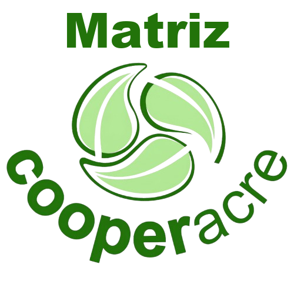

<p align="center">
  
</p>

<h1 align="center">Manual de Sistemas</h1>

<p align="center">
  Catálogo dos sistemas, planilhas e automações que a T.I. construiu para a Cooperacre: o que cada um faz, quem pediu e como é mantido.
</p>

<p align="center">
    
</p>

## O que é

Catálogo vivo das soluções da T.I. da Cooperacre. Cada sistema, planilha ou automação tem uma ficha com o que ele faz, quem
pediu, em que estágio está, como foi construído e como é mantido, escrita para leitores técnicos e não técnicos. O manual
também reúne a governança (acessos, mudanças, uso de IA) e um glossário em português simples.

## Conteúdo

| Seção | O que reúne |
|---|---|
| Catálogo | Fichas dos sistemas, a página "Por situação" e "Onde está o código" |
| Sistemas, Planilhas e Automações | Visão geral de cada grupo e as fichas de cada item |
| Filial IV | Manual operacional, planilhas e aplicativo da filial |
| Governança | Princípios, acessos, mudanças, uso de IA e credenciais |
| Glossário | Termos explicados em português simples |

## Como rodar

```bash
npm install
npm run dev        # http://localhost:4321
npm run build      # gera dist/
```

Requer Node 22.19 ou superior.

## Onde editar

- `src/content/docs/catalogo/`: fichas dos sistemas, cada uma com selo de estágio, linha do tempo e cartões.
- `src/content/docs/planilhas/` e `src/content/docs/automacoes/`: planilhas e automações.
- `src/content/docs/governanca/`: princípios, acessos, mudanças e uso de IA.
- `src/content/docs/glossario.md`: glossário.
- `src/styles/custom.css`: identidade visual. `astro.config.mjs`: menu e impressão das fichas.

As fichas são editadas à mão e são a fonte única do conteúdo. Antes de publicar um print, confira se não há cliente,
vendedor, valor ou nome de colega real.

## Manutenção e acesso

- Mudanças passam pelo responsável técnico antes de entrar na branch principal.
- Senhas, chaves e dados de clientes nunca entram no manual nem no repositório.

---

<p align="center">
  <sub>
    Desenvolvido por <b>Lucas Castro</b>, T.I. da Cooperacre, em 2026.<br>
    Parte do conjunto de sistemas internos da cooperativa. Documentado no
    <a href="https://github.com/Cooperacre/manual-sistemas">Manual de Sistemas</a>.
  </sub>
</p>
