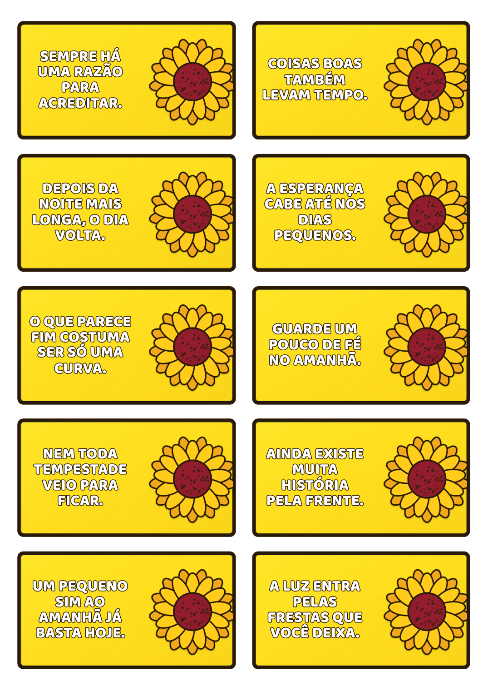
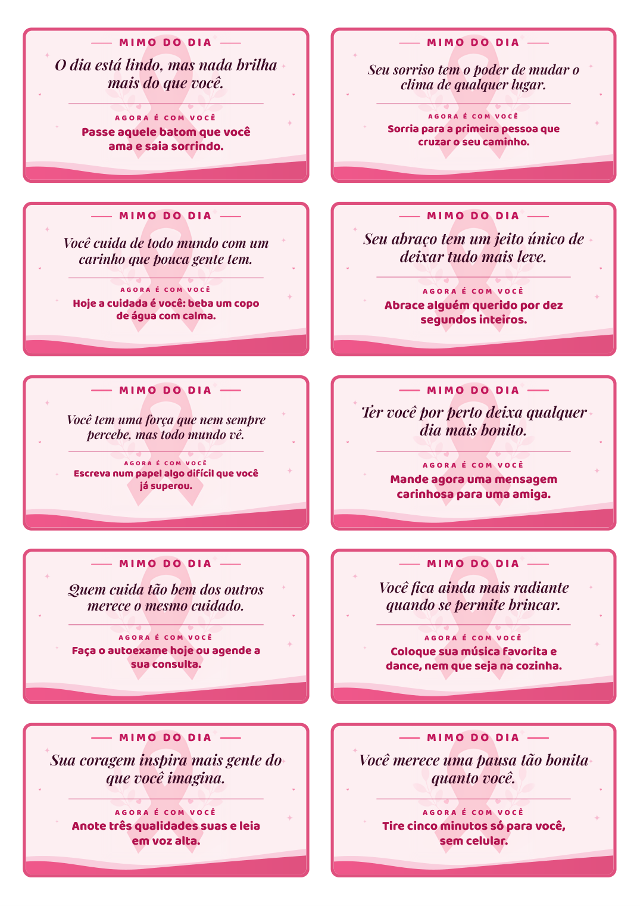

import { Badge, Card, CardGrid } from '@astrojs/starlight/components';

  <Badge text="Em uso" variant="success" size="large" />

## Em uma frase

**Transforma uma lista de frases em um PDF A4 com os cards prontos para imprimir e recortar, na quantidade que for preciso, com o texto sempre exatamente igual ao aprovado.**

Entre as artes que a Recepção pede ao T.I. para as ações temáticas, alguns pedidos incluem cards com frases, como os de Setembro Amarelo e Outubro Rosa. O gerador cuida do que é repetitivo (encaixar a frase, ajustar a letra, montar a folha e exportar o PDF), e sobra só a parte criativa: escolher as frases e a arte.

## Antes e depois

<CardGrid>
  <Card title="Antes" icon="information">
    Os cards de cada tema são montados um a um, e em alguns casos a frase vem dentro da imagem criada por ferramenta de geração de imagem.
  </Card>
  <Card title="Depois" icon="approve-check">
    A frase nunca passa por uma ferramenta de imagem: entra como texto, é conferida automaticamente e vai para um PDF com as folhas já montadas, pronto para imprimir.
  </Card>
</CardGrid>

## Pontos fortes

<CardGrid>
  <Card title="Texto sempre exato" icon="approve-check-circle">
    A frase entra como texto, nunca desenhada como imagem. O que sai no papel é exatamente o que foi aprovado na lista, sem letra trocada, e a mesma lista gera sempre o mesmo PDF.
  </Card>
  <Card title="Avisa antes de imprimir" icon="pencil">
    O programa aponta o número do card com frase repetida, quase igual a outra ou longa demais, e ajusta a letra ao espaço de cada card. Se alguma frase não couber nem no menor tamanho, diz qual é.
  </Card>
  <Card title="Um tema novo sem refazer tudo" icon="rocket">
    Cada tema guarda as suas próprias frases, cores e arte. Criar um tema novo parte de um tema já aprovado: muda a arte e as frases, e a quantidade de cards é a que o tema precisar.
  </Card>
  <Card title="Sem limite, sem custo, sem internet" icon="laptop">
    Com o tema pronto, a geração roda no próprio computador, sem plano pago, sem cota de imagens e sem depender de serviço online. Gera a quantidade de PDFs que for preciso.
  </Card>
</CardGrid>

## Como usar

Cada tema novo segue o mesmo caminho. A inteligência artificial entra na parte criativa, onde ela rende mais: a arte e as frases. A montagem e o texto que vai para o papel são feitos por regras fixas.

1. **Arte do tema.** Com apoio de IA, cria-se a arte-base do tema (moldura, ilustração e cores), sempre sem texto. Ela vira o modelo de todos os cards.
2. **Lista de frases.** A lista do tema também é escrita com apoio de IA e aprovada antes de gerar. Alguns temas têm uma segunda linha em destaque, como o "desafio do dia" do Outubro Rosa. Antes de montar, o programa confere a lista: frase repetida, quase igual a outra ou longa demais.
3. **Folha de teste.** Gera-se uma folha de prévia para aprovar o visual: arte, letra, cores e espaço do texto. Depois que ela é aprovada, só as frases mudam.
4. **Quantidade e geração.** Define-se quantos cards o tema terá e gera-se o conjunto completo. Se uma frase for trocada depois, dá para refazer só a folha dela.
5. **PDF pronto.** A saída é um único PDF em A4, com os cards prontos para imprimir e recortar. A impressão é em tamanho real (100%, sem "ajustar à página"), e a borda de cada card serve de guia de corte.

## Temas já gerados

- **Setembro Amarelo:** frases de esperança e recomeço, com fundo amarelo e girassol.
- **Outubro Rosa:** o "Mimo do dia", com uma frase de carinho e um pequeno desafio. Foram feitas duas versões de layout, com as mesmas frases.

## Telas

**Folha do Setembro Amarelo**, em A4:

**Folha do Outubro Rosa**, com frase e desafio do dia:

## Pontos de atenção

- Precisa de Python e de um navegador (Edge ou Chrome) instalados no computador de quem gera, porque o PDF é montado pelo navegador, sem abrir janela.
- A arte-base de cada tema é criada fora do gerador, e a área do texto precisa ficar livre nela.
- Depois que a primeira folha de um tema é aprovada, só as frases devem mudar, para o resultado continuar consistente.

## Quem está por trás

<CardGrid>
  <Card title="Quem pediu" icon="pencil">
    Iniciativa do desenvolvedor, para a Recepção.
  </Card>
  <Card title="Quem usa" icon="laptop">
    **Lucas Castro**, T.I.: cria os temas e gera os PDFs, com apoio de IA.

    **Taliane**, Recepção: pede os cards nas ações e datas temáticas e recebe o PDF pronto para imprimir.
  </Card>
  <Card title="Quem construiu" icon="rocket">
    **Lucas Castro**, T.I.
    Nível técnico: Fullstack Pleno
  </Card>
  <Card title="Até quando" icon="information">
    Sem prazo definido: é usado e atualizado conforme a Recepção pedir novos cards.
  </Card>
</CardGrid>
