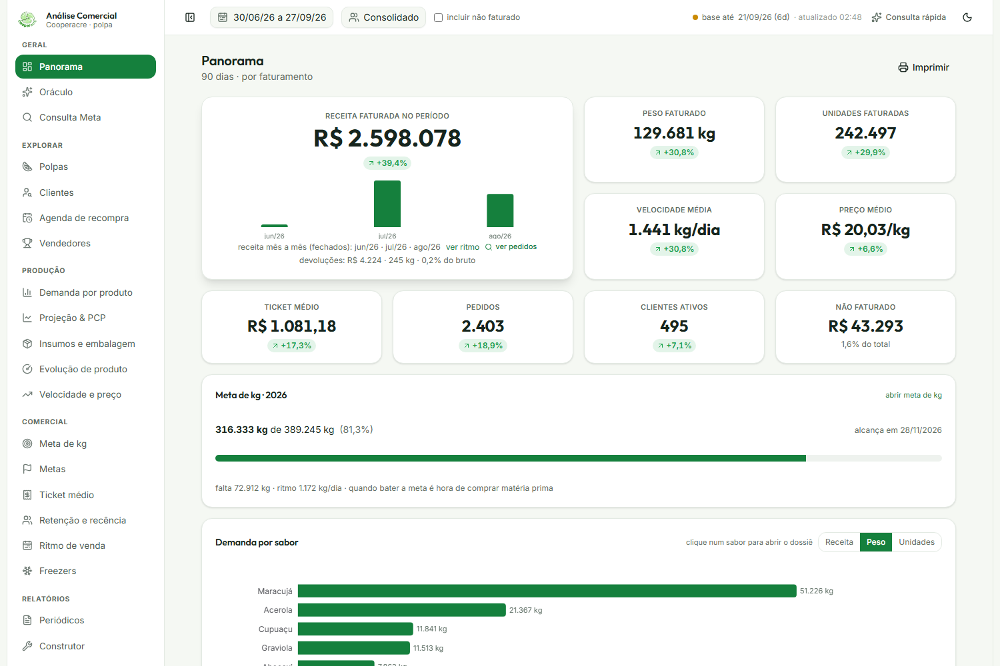
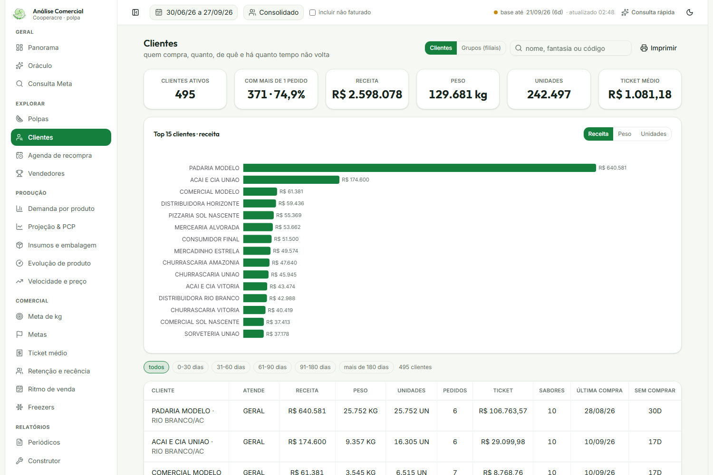
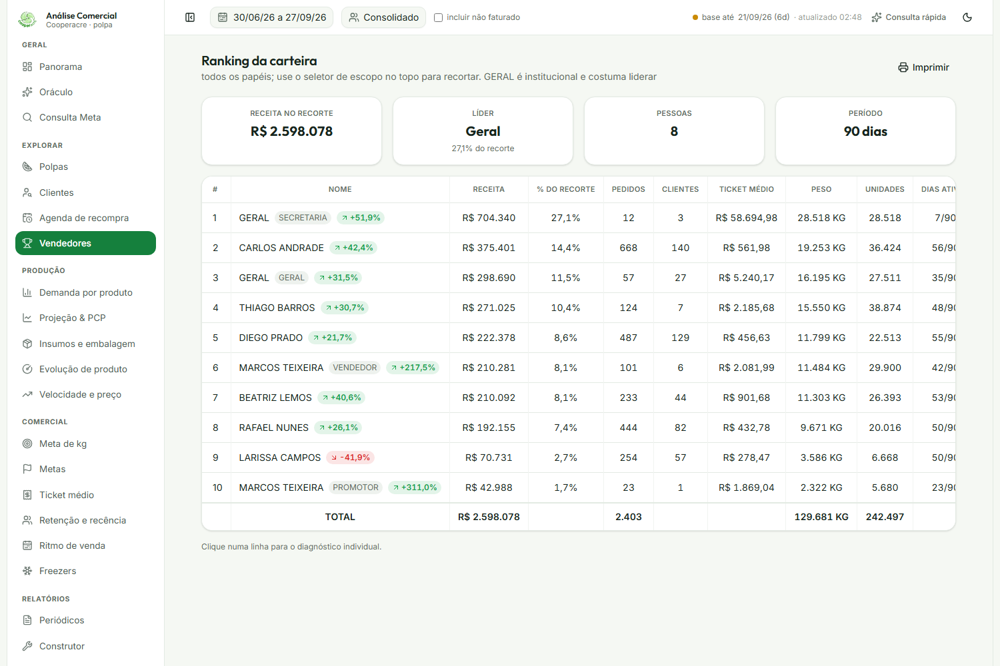
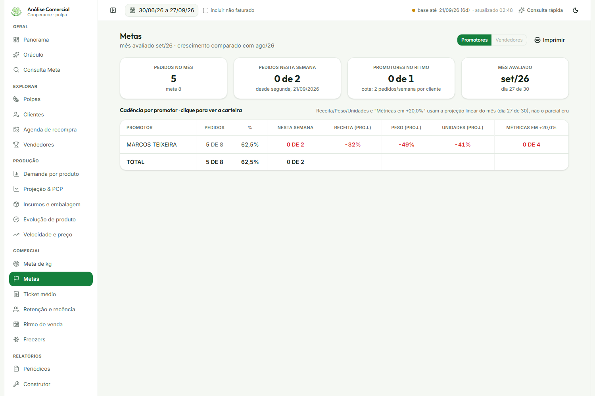
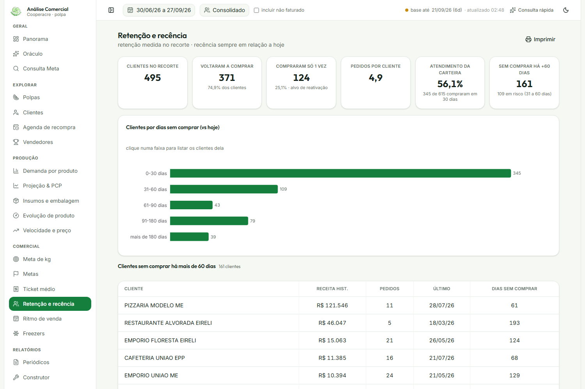
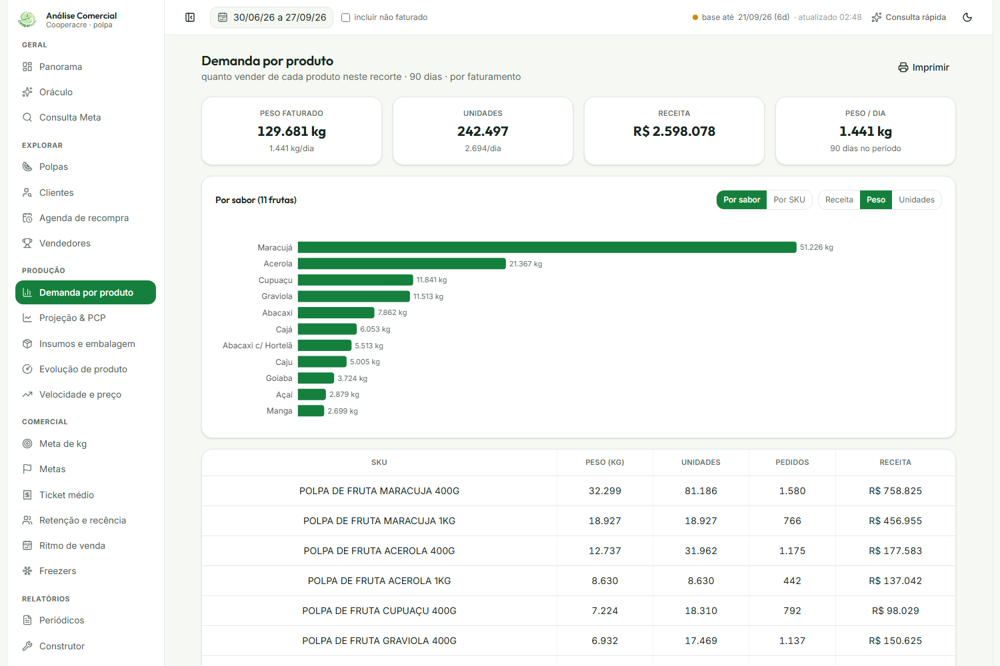
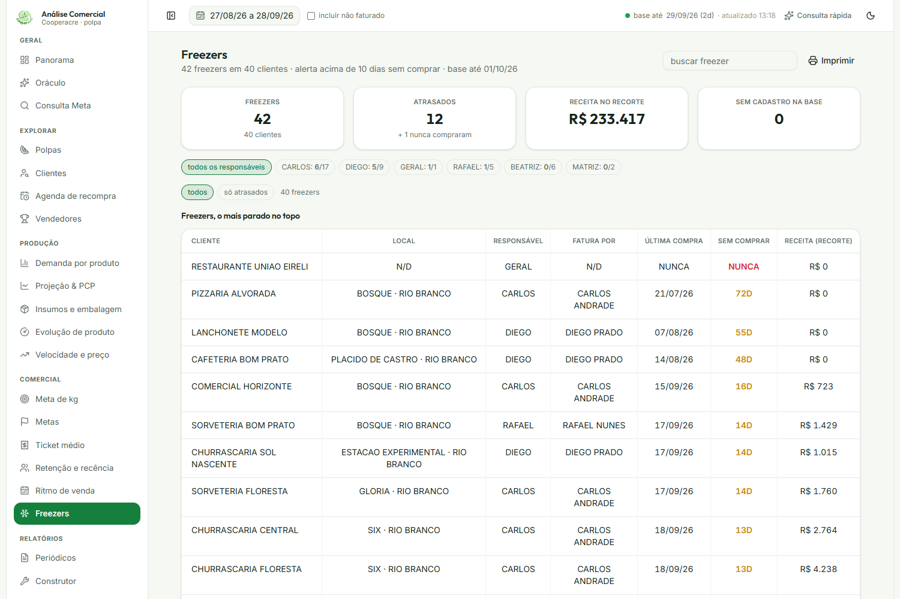
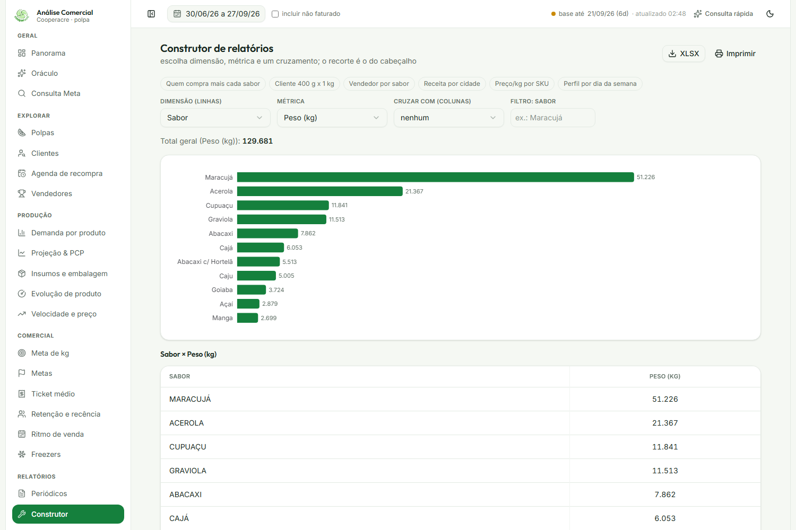
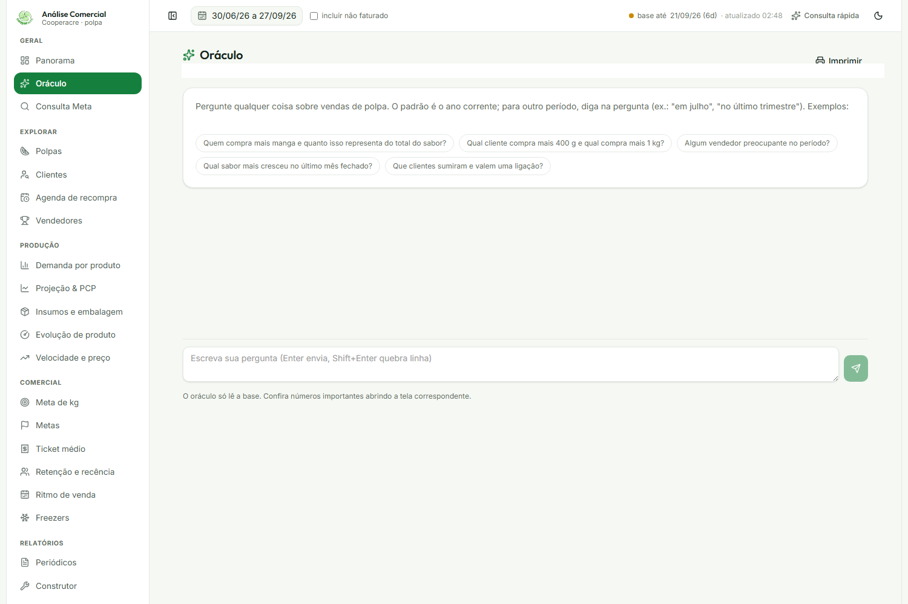

import { Badge, Card, CardGrid } from '@astrojs/starlight/components';

  <Badge text="Em uso" variant="success" size="large" />
  <Badge text="Rede privada" variant="note" size="large" />

## Em uma frase

**CRM e painel de análise comercial: reúne vendas, carteira de clientes, desempenho dos vendedores, metas, planejamento de produção e roteirização, com dados do sistema de gestão atualizados a cada hora e um assistente de IA para consultar os números em português.**

## Antes e depois

<CardGrid>
  <Card title="Antes" icon="information">
    Quem comprou, quem parou de comprar, o desempenho de cada vendedor e a organização da visita e da entrega são acompanhados em relatório manual e planilha.
  </Card>
  <Card title="Depois" icon="approve-check">
    Painel único, com dados atualizados a cada hora, cobrindo vendas, carteira de clientes, desempenho de vendedores, roteirização, metas, freezers em comodato e um assistente de IA para perguntar em português.
  </Card>
</CardGrid>

## Linha do tempo

| Quando | O que aconteceu |
|---|---|
| **jul/2026** | Início do desenvolvimento, a pedido de Kássio (gestor comercial) |
| **set/2026** | Em uso por Kássio, Paulo e Maxsuel, pela rede privada |

## Pontos fortes

Tudo é medido em três números: **receita, peso e unidades**. O que muda é o ângulo de cada análise.

<CardGrid>
  <Card title="Vendas" icon="rocket">
    O período comparado com o anterior e a meta de quilos do ano, com a data prevista para alcançá-la.
  </Card>
  <Card title="Vendedores" icon="laptop">
    Ranking da carteira, com cada pessoa comparada ao próprio histórico e aos pares do mesmo papel.
  </Card>
  <Card title="Frutas" icon="approve-check-circle">
    Quais sabores mais saem, em que ritmo, e quanto produzir no próximo ciclo.
  </Card>
  <Card title="Clientes" icon="pencil">
    Quem são os maiores, quem parou de comprar e quando cada um deve voltar.
  </Card>
</CardGrid>

## O que ele faz

**Painel geral:** receita, peso, unidades, ticket médio, velocidade de venda e preço médio do período, sempre comparados com o período anterior; meta de quilos do ano com projeção da data em que será alcançada; demanda por sabor e SKU.

**Auditoria de qualquer número:** todo indicador, barra ou linha abre a lista de pedidos que o compõe, e a soma bate com o número de origem. Isso vale também para o que ainda não foi faturado, que pode ser conferido pedido a pedido em segundos.

**Carteira de clientes:** todos os clientes ativos, ranking dos maiores, segmentação por tempo sem comprar, grupos por CNPJ (matriz e filiais somadas), retenção (quem volta, quem comprou só uma vez, quem está em risco) e a agenda de recompra, que mostra quando cada cliente deve voltar a comprar, pela cadência do próprio histórico.

**Desempenho de vendedores e promotores:** ranking da carteira comercial, diagnóstico individual que compara cada pessoa com os pares do mesmo papel, ritmo de venda e metas de cadência de visita.

**Metas:** meta de quilos do ano, metas mensais com crescimento sobre o mês-base e metas próprias dos contratos institucionais (secretarias e órgãos), acompanhadas à parte da carteira comercial.

**Produção e planejamento:** projeção de quanto produzir no próximo ciclo, por sabor, em quilos e em unidades de cada tamanho; um simulador de cenário, que recalcula a projeção a partir de um crescimento percentual ou de uma meta absoluta; e os insumos, com a quantidade de embalagem a comprar por tamanho.

**Evolução e preço:** evolução de um produto ao longo do tempo, velocidade de venda e preço por produto, e ticket médio.

**Logística e roteirização:** roteiro de visita por vendedor e circuito único de entrega, que cruza a rota de todos.

**Freezers em comodato:** controle de todos os freezers emprestados, responsável de cada um, alerta de freezer parado.

**Relatórios e assistente de IA:** o Construtor, para o gestor cruzar dimensão e métrica sem pedir relatório pronto a ninguém, e o Oráculo, que responde perguntas em português sobre os dados.

Hoje o escopo é só a linha de polpa de fruta. É uma escolha, não uma limitação técnica: a arquitetura não é amarrada a um produto e se estende a outras linhas se fizer sentido para o negócio.

## Resultados

O painel auxilia o Comercial com informações rápidas e indicadores (KPIs, os números-chave que mostram como o negócio está indo) para apoiar as decisões do dia a dia. Na prática:

- **Vendedores:** a comparação de cada vendedor com o próprio histórico e com os pares do mesmo papel ajuda a gestão a ver quem está evoluindo e onde atuar.
- **Recompra:** a lista de clientes que devem voltar a comprar, pela cadência de cada um, apoia a abordagem comercial.
- **Planejamento:** a projeção de produção e o simulador de cenário trazem a demanda por sabor para perto de quem decide.
- **Contratos institucionais:** as metas dos contratos de secretarias são acompanhadas à parte.
- **Conferência:** é possível ver o que ainda não foi faturado e abrir os pedidos por trás de cada número.

## Quem está por trás

<CardGrid>
  <Card title="Quem pediu" icon="pencil">
    **Kássio**, gestor comercial, que definiu a lógica e as regras de negócio do sistema.

    **Paulo**, gestor de polpas, que definiu o formato de alguns relatórios.
  </Card>
  <Card title="Quem usa" icon="laptop">
    **Kássio**, **Paulo** e **Maxsuel**.
  </Card>
  <Card title="Quem construiu" icon="rocket">
    **Lucas Castro**, T.I.
    Nível técnico: Fullstack Pleno
  </Card>
  <Card title="Até quando" icon="information">
    Temporário: descontinuação prevista com a troca do Meta pelo TOTVS, go live em 01/01/2027.
  </Card>
</CardGrid>

## Fonte dos dados

Base de vendas mantida pelo [Meta Pipeline](/catalogo/meta-pipeline/) e lida pelo painel a cada hora. Sem planilhas e sem digitação.

## Telas do sistema

*Todos os prints abaixo usam nomes de clientes, vendedores e endereços fictícios, gerados a partir de uma cópia anonimizada da base real. Os valores de venda, produtos e datas são reais.*

**Panorama:** a visão executiva, com a meta de quilos do ano e a demanda por sabor.

**Clientes:** a carteira inteira, com ranking dos maiores e segmentação por tempo sem comprar.

**Vendedores:** o ranking da carteira comercial, com receita, pedidos e crescimento de cada um.

**Metas:** cadência de visita dos promotores, comparada com a cota da semana.

**Retenção e recência:** quantos clientes voltam a comprar e quais estão em risco.

**Demanda por produto:** volume por sabor e por SKU.

**Freezers:** controle dos freezers em comodato e alerta de quem parou de comprar.

**Construtor de relatórios:** o gestor escolhe dimensão e métrica e cruza os dados sem precisar pedir um relatório pronto.

**Oráculo:** o assistente de IA que responde perguntas em português sobre os dados do painel.

