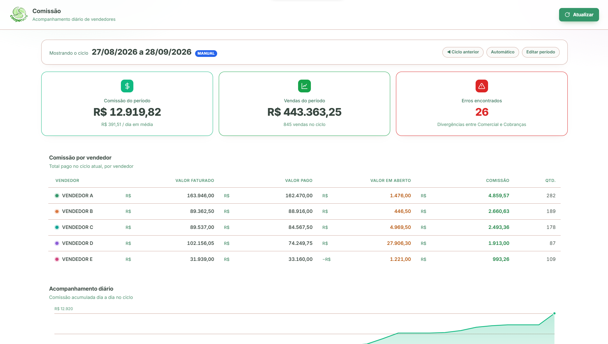
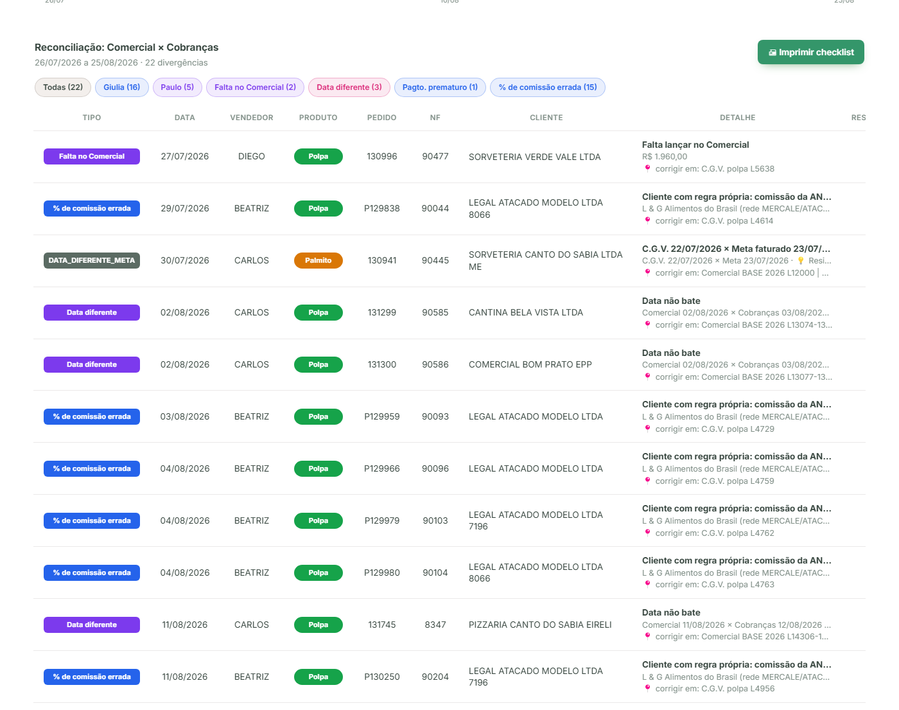
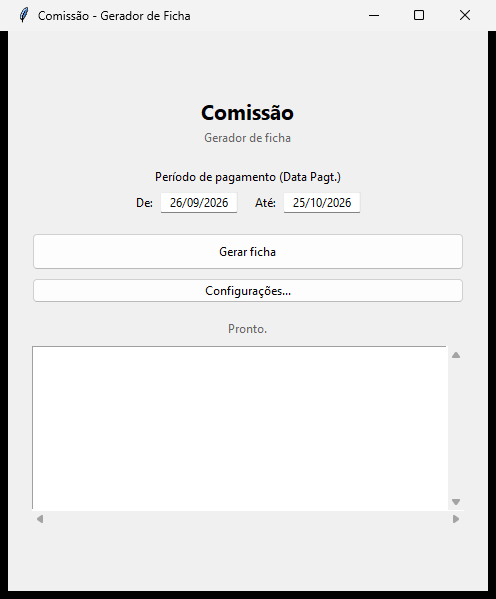
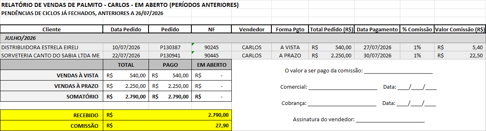
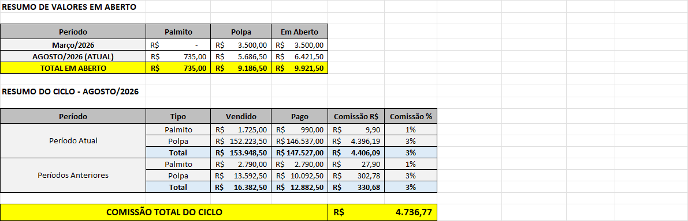

import { Badge, Card, CardGrid } from '@astrojs/starlight/components';

  <Badge text="Em uso" variant="success" size="large" />
  <Badge text="Rede privada" variant="note" size="large" />

## Em uma frase

**Duas frentes em um só sistema: a auditoria diária dos dados, que confronta o que o Comercial, a Cobrança e o Meta registraram e aponta cada divergência, e o gerador das fichas de comissão, que monta a ficha de cada vendedor ao final do período.**

Quando a divergência aparece no dia em que aconteceu, ela se corrige em minutos. Quando só aparece no fechamento, vira retrabalho, atraso no pagamento e dúvida sobre o número certo.

## Antes e depois

### Auditoria diária dos dados

<CardGrid>
  <Card title="Antes" icon="information">
    Comercial e Cobrança lançavam a mesma venda em planilhas separadas, e a conferência entre elas e com o Meta acontecia no fechamento.
  </Card>
  <Card title="Depois" icon="approve-check">
    Um **confronto triplo** roda todo dia e aponta exatamente o arquivo, a aba e a linha de cada divergência.
  </Card>
</CardGrid>

### Ficha de comissão

<CardGrid>
  <Card title="Antes" icon="information">
    A ficha era montada à mão, venda por venda, de cada período e de cada vendedor ou promotor, separando os períodos passados e a polpa do palmito.
  </Card>
  <Card title="Depois" icon="approve-check">
    A ficha é gerada automaticamente, a partir de um modelo, depois que os dados já foram conferidos. Sai separada por vendedor ou promotor, por período e por produto (polpa e palmito), **em segundos**.
  </Card>
</CardGrid>

## Linha do tempo

| Quando | O que aconteceu |
|---|---|
| **jul/2026** | Pedido conjunto de Paulo e Auricélio (comercial polpa) e Giulia (cobrança). Início do desenvolvimento |
| **set/2026** | Kássio pede um novo layout de ficha, separando o valor do período atual do histórico em aberto |
| **set/2026** | Novo layout em uso desde o fim do mês. Em uso: painel de auditoria diária + gerador de ficha no fechamento |

## Pontos fortes

<CardGrid>
  <Card title="Confronto de três fontes, todo dia" icon="approve-check-circle">
    Cruza a planilha de Cobranças, a do Comercial e uma cópia do Meta, trazida pelo [Meta Pipeline](/catalogo/meta-pipeline/), e aponta o arquivo, a aba e a linha exatas de cada divergência, não só o número final errado.
  </Card>
  <Card title="~40 regras de negócio documentadas" icon="pencil">
    O cálculo de comissão tem exceções reais (rede de supermercado com regra própria, cliente com nome grafado diferente entre sistemas, vendedor que mudou de função). A documentação das regras é **gerada a partir do próprio código**, então nunca fica desatualizada.
  </Card>
  <Card title="Prova de conservação de valor" icon="setting">
    O total apurado da comissão precisa sempre bater com a soma das partes: uma checagem automática contra erro de cálculo, a cada rodada.
  </Card>
  <Card title="Checklist para corrigir" icon="rocket">
    O painel imprime um checklist das divergências do filtro atual, com uma caixa para marcar cada correção feita, pensado para o uso real de quem concilia.
  </Card>
</CardGrid>

## O que ele evita, na prática

- Uma venda lançada por um setor e **esquecida pelo outro**
- Uma venda que existe no Meta mas nunca foi lançada em nenhuma das duas planilhas
- O **mesmo pedido com valor diferente** entre as fontes
- O **vendedor errado** anotado numa das planilhas
- A **data** de pedido ou de pagamento divergente entre as fontes
- **Percentual de comissão errado** numa linha (cliente com regra especial lançado com o percentual padrão)
- **Pagamento lançado antes do próprio pedido** (indício de erro de digitação de data)

Trecho da lista de divergências encontradas entre Comercial e Cobranças, com o tipo, o arquivo e a linha exata de cada uma:

## Gerador da ficha de comissão

Aplicativo de computador, sem precisar de internet, usado no fechamento. O usuário escolhe o período de pagamento e clica em "Gerar ficha": o sistema lê as mesmas fontes já conferidas pelo painel e produz um Excel com uma aba por vendedor, com o detalhado do período em aberto, o detalhado do período atual, o resumo de valores em aberto e o resumo do ciclo (vendido e pago, separando período atual de anteriores).

## Resultados

A conferência entre os três controles passou a acontecer **todo dia**, em vez de só no fechamento. Um número de horas economizadas por ciclo ainda não foi medido com a equipe; quando houver, entra aqui.

## Quem está por trás

<CardGrid>
  <Card title="Quem pediu" icon="pencil">
    **Paulo** e **Auricélio**, comercial polpa.

    **Giulia**, cobrança.

    Pedido feito em conjunto.
  </Card>
  <Card title="Quem usa" icon="laptop">
    **Giulia**: faz o fechamento e gera as fichas.

    **Paulo** e **Kássio**: acompanham a comissão do comercial polpa pelo painel.
  </Card>
  <Card title="Quem construiu" icon="rocket">
    **Lucas Castro**, T.I.
    Nível técnico: Fullstack Pleno
  </Card>
  <Card title="Até quando" icon="information">
    Temporário.

    Descontinuação prevista com a troca do Meta pelo TOTVS (go live em 01/01/2027).
  </Card>
</CardGrid>

## Fontes de dados

- Planilha de cobranças (C.G.V., base da comissão)
- Planilha de controle de vendas do Comercial
- Cópia dos dados do Meta, via [Meta Pipeline](/catalogo/meta-pipeline/)

## Telas do sistema

*Os prints acima usam nomes de clientes e de vendedores fictícios, gerados a partir de uma cópia anonimizada das planilhas reais. Os valores de venda são reais, de um ciclo já fechado.*

## Planilhas relacionadas

Planilha de cobranças (C.G.V.) e planilha de controle de vendas.
