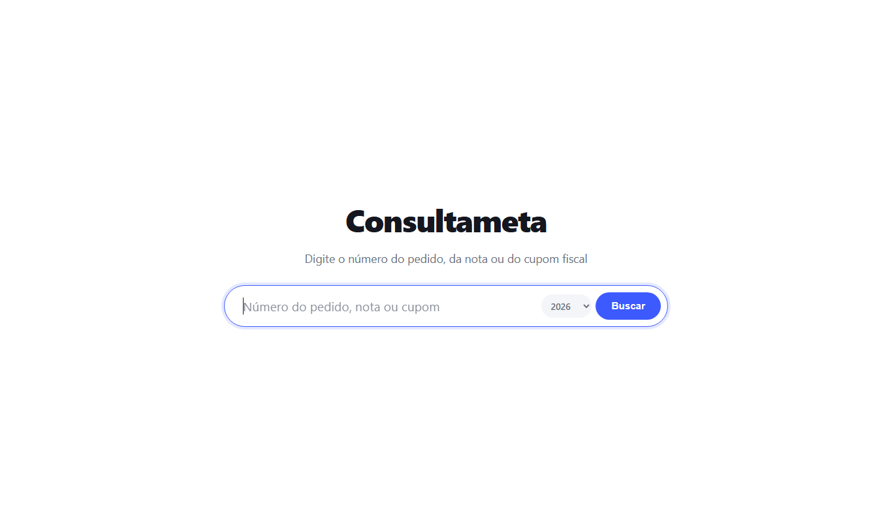
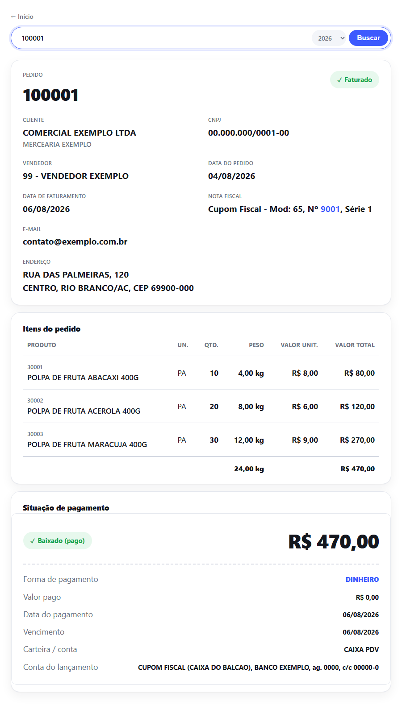
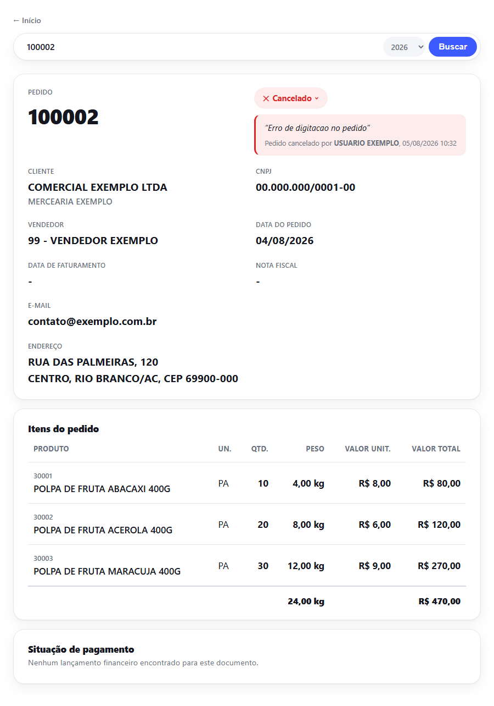

import { Badge, Card, CardGrid } from '@astrojs/starlight/components';

  <Badge text="Em uso" variant="success" size="large" />
  <Badge text="Rede privada" variant="note" size="large" />

## Em uma frase

**Digite o número de um pedido, nota fiscal ou cupom e veja na hora tudo sobre o documento: cliente, vendedor, datas, itens, totais e situação de pagamento.**

Os dados vêm do [Meta Pipeline](/catalogo/meta-pipeline/), que traz as informações do sistema de gestão da cooperativa. A consulta alcança pedidos de qualquer época, inclusive os antigos.

## Antes e depois

<CardGrid>
  <Card title="Antes" icon="information">
    As informações completas de um pedido, nota ou cupom são consultadas no Meta, em telas técnicas, várias vezes por dia por Cobrança, Comercial Polpa e Contábil.
  </Card>
  <Card title="Depois" icon="approve-check">
    Um número, uma busca, a resposta legível na tela: cliente, itens, totais, situação de faturamento e de pagamento.
  </Card>
</CardGrid>

## Linha do tempo

| Quando | O que aconteceu |
|---|---|
| **set/2026** | Início do desenvolvimento, iniciativa do desenvolvedor |

## Pontos fortes

<CardGrid>
  <Card title="Rastreia o caminho entre documentos" icon="setting">
    De um pedido chega à nota ou ao cupom gerado, e da nota ou do cupom volta ao pedido de origem.
  </Card>
  <Card title="Pagamento na mesma tela" icon="approve-check-circle">
    Mostra se o documento foi baixado ou está em aberto, com forma de pagamento, valor, datas e a conta do lançamento.
  </Card>
  <Card title="Mostra quem cancelou" icon="pencil">
    Quando um documento está cancelado, o sistema mostra quem cancelou, não só que está cancelado.
  </Card>
  <Card title="Qualquer época, na hora" icon="rocket">
    Basta escolher o ano: pedidos recentes e antigos aparecem com o mesmo nível de detalhe, sem abrir o sistema de gestão.
  </Card>
</CardGrid>

## Como usar

Escolha o ano, digite o número do pedido, da nota fiscal ou do cupom e faça a busca. A resposta aparece na hora, sem precisar abrir o sistema de gestão.

## O que ele faz

- Busca por pedido, nota fiscal ou cupom fiscal, com escolha do ano
- Mostra cliente, vendedor, datas, itens e totais
- Situação de faturamento (faturado, cancelado) e, quando cancelado, quem cancelou
- Situação de pagamento (baixado ou em aberto), com forma de pagamento, valor, datas e conta do lançamento

## Quem está por trás

<CardGrid>
  <Card title="Quem pediu" icon="pencil">
    Iniciativa própria do desenvolvedor, moldada pelas necessidades de Cobrança, Comercial Polpa e Contábil.
  </Card>
  <Card title="Quem usa" icon="laptop">
    **Cobrança**, **Comercial Polpa** e **Contábil**.
  </Card>
  <Card title="Quem construiu" icon="rocket">
    **Lucas Castro**, T.I.
    Nível técnico: Fullstack Pleno
  </Card>
  <Card title="Até quando" icon="information">
    Temporário: consulta o Meta. Depois de 01/01/2027, dependerá de adaptação ao TOTVS ou será encerrada.
  </Card>
</CardGrid>

## Telas do sistema

Resultado de uma consulta (pedido faturado, com itens e situação de pagamento):

Pedido cancelado, com o motivo e quem cancelou (aparece ao clicar na etiqueta):

*Os prints usam dados fictícios, gerados na própria tela do sistema.*
