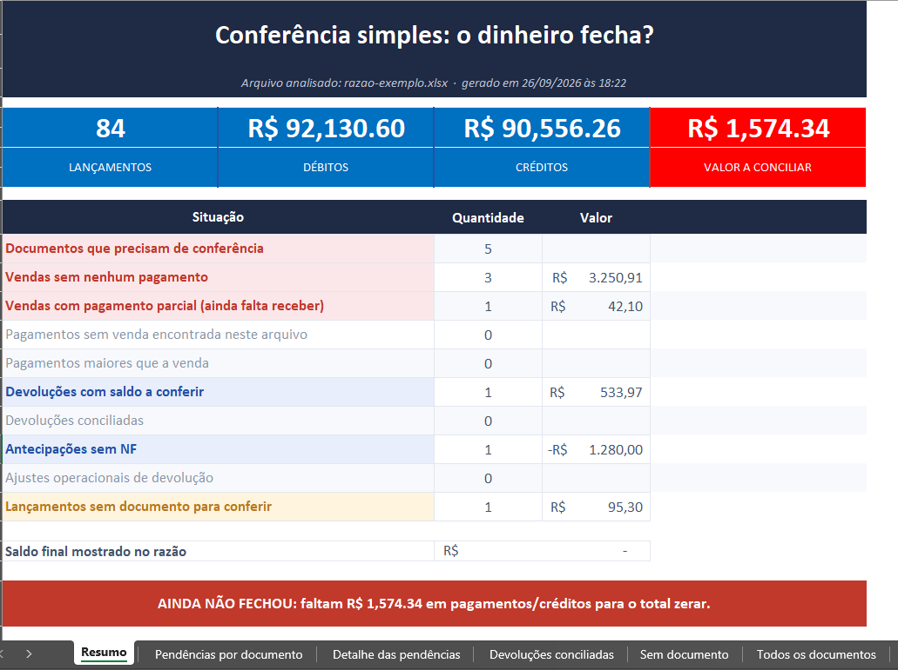
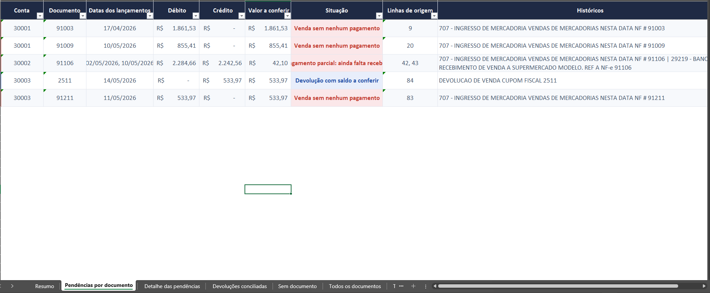
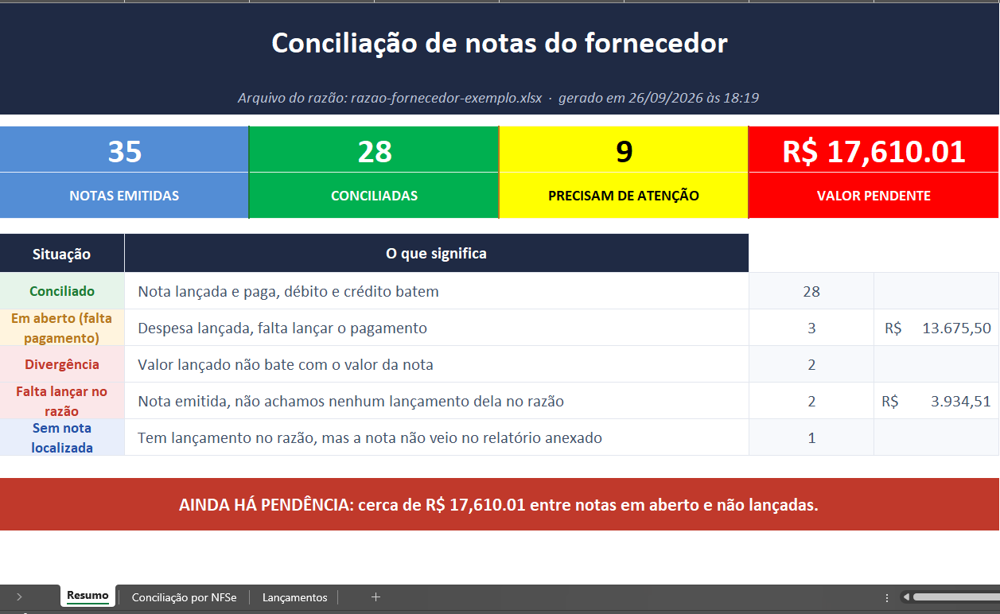
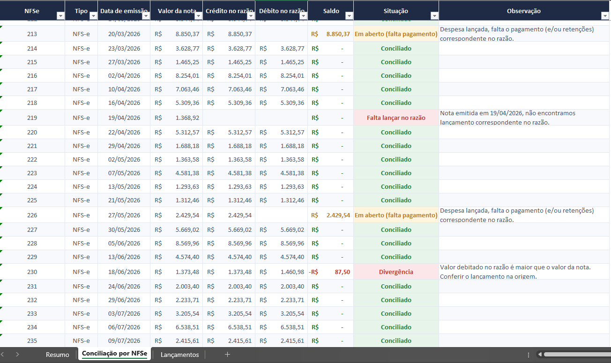
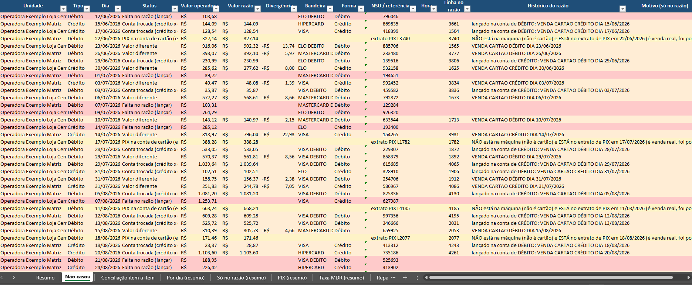
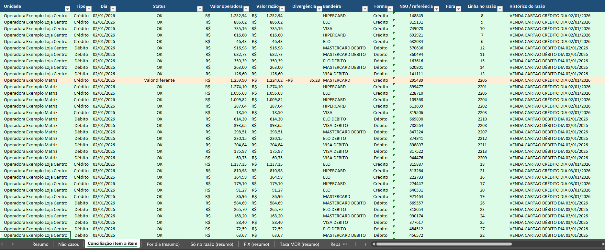

import { Badge, Card, CardGrid } from '@astrojs/starlight/components';

  <Badge text="Em uso" variant="success" size="large" />

## Em uma frase

**Concilia o razão contábil: confere cada lançamento contra regras definidas com a equipe contábil, contra as notas fiscais dos fornecedores e contra as vendas da operadora de cartão, e entrega uma planilha pronta com o que está conciliado e o que precisa de atenção.**

Uma conta com saldo zerado não está necessariamente conciliada de forma correta: pode haver valor lançado no dia errado, na conta errada ou com nota digitada errada. É isso que a conferência procura.

## Antes e depois

<CardGrid>
  <Card title="Antes" icon="information">
    A conciliação era feita lançamento por lançamento, manualmente, e o tempo de trabalho crescia com o tamanho do período.
  </Card>
  <Card title="Depois" icon="approve-check">
    A conciliação e a detecção de possíveis pendências levam **segundos**, mesmo em períodos longos. A análise e a correção das pendências continuam humanas e ficam concentradas no que o sistema aponta.
  </Card>
</CardGrid>

## Linha do tempo

| Quando | O que aconteceu |
|---|---|
| **set/2026** | Início do desenvolvimento, a partir da conciliação de cartão. Em uso pela equipe contábil, com novas conferências em desenvolvimento |

## Resultados

**Na prática:** uma conta de cartões de janeiro a agosto (oito meses) foi conciliada com cerca de **dois dias** de trabalho humano, não contínuos. Pela estimativa da equipe, conciliar à mão um período tão longo levaria cerca de **duas semanas**. A conciliação em si leva segundos; os dois dias foram dedicados a analisar e corrigir as pendências, que continuam sendo decisão da profissional.

**O que rodar um programa muda no trabalho:**

- **Escala:** o razão inteiro é conferido lançamento por lançamento, em segundos, e o esforço da profissional deixa de crescer com o tamanho do período. O que levaria dias de leitura página a página vira uma planilha pronta.
- **Nenhuma linha fica de fora:** a mesma regra vale para todos os lançamentos, do primeiro ao último, sem cansaço nem variação de critério de um dia para o outro.
- **Já vem orientado:** cada pendência chega classificada pela causa provável (valor diferente, data trocada, lançamento com PIX, venda sem correspondência) e com a linha de origem no razão, para a profissional ir direto ao que precisa de atenção, em vez de procurar.
- **Tempo para o que é humano:** o que sobra é análise, conversa com o fornecedor ou a operadora e correção, que é onde a experiência do profissional faz diferença.
- **Repetível:** a próxima conta, ou o próximo período, passa pelas mesmas regras e gera o mesmo tipo de relatório.

## Pontos fortes

<CardGrid>
  <Card title="Regras fixas, resultado reproduzível" icon="approve-check-circle">
    Tolerâncias, janelas de dias, mapeamentos e critérios ficam em configuração e código, não em conversa. O mesmo arquivo gera sempre o mesmo resultado, sem deixar linha de fora.
  </Card>
  <Card title="Rastreável até a linha de origem" icon="pencil">
    Cada pendência aponta a linha do razão, para conferir no Domínio.
  </Card>
  <Card title="Roda sem internet" icon="setting">
    No computador do usuário, sem cota de uso e sem enviar dado a serviço externo.
  </Card>
  <Card title="Sem alucinação" icon="rocket">
    Sem IA generativa na execução: o sistema não inventa valor, nota ou explicação, só aponta o que as regras identificam.
  </Card>
</CardGrid>

## Por que dá para confiar

Os dados do razão são sensíveis, e o sistema foi desenhado para que cada resultado possa ser conferido.

- **Regras da própria contabilidade:** definidas pela equipe contábil junto com o desenvolvedor e validadas pela contadora antes de entrarem em uso.
- **Resultado que se confere:** o mesmo arquivo gera sempre o mesmo resultado, e cada pendência aponta a linha de origem no razão.
- **Dados em casa:** roda no computador de quem usa, sem enviar informação para fora, sem limite nem custo por uso.
- **A decisão é da contadora:** o sistema aponta, e a análise e a decisão sobre cada pendência são sempre dela.

## O que ele faz

O usuário exporta o razão do Domínio (`.xls`) e arrasta o arquivo sobre o atalho da conferência desejada. O que muda é contra o que o razão é conferido:

1. **Conferência do razão** (razão contra ele mesmo): débitos e créditos fecham, nota ou cupom com saldo em aberto, devolução, antecipação sem nota, possível erro de digitação do número da nota. A que deu o melhor resultado na prática até agora.
2. **Notas do fornecedor**: razão do fornecedor contra as notas fiscais de entrada e de serviço (NF-e e NFS-e) obtidas no Arquivei.
3. **Cartão**: cada venda da operadora contra o razão, por dia, valor e tipo, incluindo taxas e repasses.
4. **Razão × balancete:** cruza o razão com os totais do balancete por conta.

## Quem está por trás

<CardGrid>
  <Card title="Quem pediu" icon="pencil">
    O **setor contábil**, que pediu auxílio de automação para as conciliações manuais.

    É quem define as regras de negócio, o layout dos relatórios e valida cada conferência.
  </Card>
  <Card title="Quem usa" icon="laptop">
    O **setor contábil**.
  </Card>
  <Card title="Quem construiu" icon="rocket">
    **Lucas Castro**, T.I.
    Nível técnico: Fullstack Pleno
  </Card>
  <Card title="Até quando" icon="information">
    Evolui conforme a necessidade: cada tipo de conta ganha suas regras à medida que a equipe as define.
  </Card>
</CardGrid>

## Telas do sistema

:::note
Todos os relatórios abaixo foram gerados automaticamente com **dados fictícios** (operadora, lojas, clientes, fornecedor, notas e valores inventados, com diferenças plantadas de cada tipo). O sistema real produz planilhas neste mesmo formato, a partir do razão exportado do Domínio.
:::

**Conferência do razão**

**Notas do fornecedor**

**Cartão**

## Planilhas relacionadas

Saída em planilha `.xlsx` para imprimir e arquivar. Cada conferência gera o seu arquivo.
