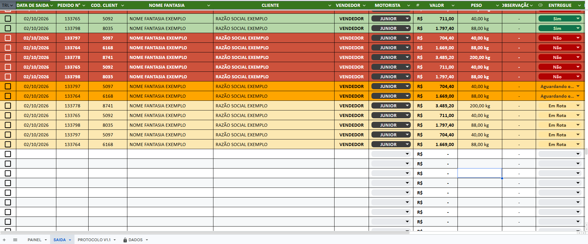
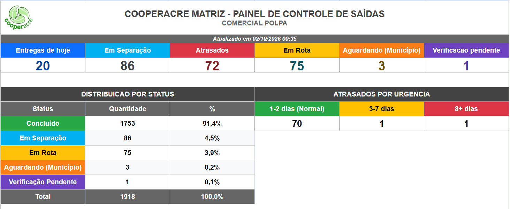
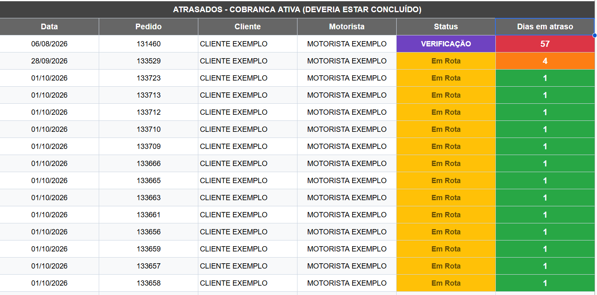
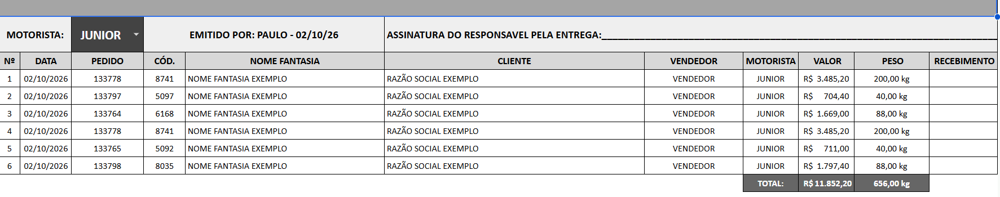

import { Badge, Card, CardGrid } from '@astrojs/starlight/components';

  <Badge text="Em uso" variant="success" size="large" />

## Em uma frase

**Acompanha o status de cada entrega da Matriz, do pedido à conferência, e gera o protocolo de entrega pronto para cada motorista, alimentado continuamente pelo Meta Pipeline.**

## Antes e depois

<CardGrid>
  <Card title="Antes" icon="information">
    Saber o que já saiu, o que está atrasado e o que falta é feito perguntando pessoa a pessoa, e o protocolo de entrega é montado à mão para cada motorista.
  </Card>
  <Card title="Depois" icon="approve-check">
    Painel mostra em tempo quase real o que está em separação, em rota, atrasado ou concluído, e o protocolo de entrega sai pronto para imprimir, por motorista.
  </Card>
</CardGrid>

## Pontos fortes

<CardGrid>
  <Card title="Alimentado continuamente pelo Meta Pipeline" icon="approve-check-circle">
    Assim que uma venda é registrada no sistema da cooperativa, uma rotina automática, o [Meta Pipeline](/catalogo/meta-pipeline/), busca essa informação a cada poucos minutos e copia para a aba chamada DADOS desta planilha. Ninguém digita o pedido, o cliente ou o valor: por isso essa aba fica travada, e ninguém pode editá-la na mão.
  </Card>
  <Card title="Protocolo pronto para imprimir" icon="pencil">
    Ao escolher o motorista, a planilha gera a ficha de protocolo com todos os pedidos dele, totais de valor e peso, e campo de assinatura para o recebimento.
  </Card>
  <Card title="Atrasados por faixa de urgência" icon="setting">
    O painel separa os pedidos atrasados por quanto tempo estão parados, para priorizar a cobrança de quem está há mais tempo esperando.
  </Card>
  <Card title="Base única para outras planilhas" icon="rocket">
    Transferência Estoque Balcão e Controle Interno buscam dados aqui por fórmula, em vez de duplicar o registro do pedido.
  </Card>
</CardGrid>

## Como funciona

**DADOS** (travada, ninguém edita): assim que um pedido é faturado no Meta, o [Meta Pipeline](/catalogo/meta-pipeline/) busca essa informação a cada poucos minutos, e copia para esta aba. Nenhuma pessoa digita nada aqui.

**SAIDA**: um pedido por linha, com as informações do pedido e as marcações feitas pela equipe (motorista responsável e situação da entrega). As demais colunas vêm da aba DADOS por fórmula.

**PAINEL**: totais do dia, em separação, atrasados (por faixa de urgência), em rota, aguardando e verificação pendente, além da distribuição por status. Formado só por fórmulas, sem rotina rodando nele.

**PROTOCOLO**: ao escolher o motorista, gera automaticamente a ficha de protocolo para impressão, com todos os pedidos daquele responsável, totais de valor e peso, campo de assinatura e coluna de recebimento.

## Quem está por trás

<CardGrid>
  <Card title="Quem pediu" icon="pencil">
    **Paulo**, Comercial Polpa.
  </Card>
  <Card title="Quem usa" icon="laptop">
    **Paulo**.
  </Card>
  <Card title="Quem construiu" icon="rocket">
    **Lucas Castro**, T.I.
    Nível técnico: Fullstack Pleno
  </Card>
  <Card title="Até quando" icon="information">
    Temporário: complementado pelo CooperFlow, com os dois convivendo em paralelo, e ambos com descontinuação prevista com a troca do Meta pelo TOTVS (go live em 01/01/2027).
  </Card>
</CardGrid>

## Telas do sistema

*Nomes de clientes e vendedores são fictícios; pedidos, valores e totais são reais.*

**Aba SAIDA**, um pedido por linha, com motorista e situação da entrega, em cores:

**Aba PAINEL**, totais por situação, distribuição por status e atrasados por urgência:

E o detalhamento dos pedidos atrasados, com motorista, situação e dias de atraso:

**Aba PROTOCOLO**, a ficha de entrega do motorista, pronta para imprimir e assinar:

## Planilhas relacionadas

Transferência Estoque Balcão e Controle Interno, que buscam dados na aba DADOS desta planilha.
