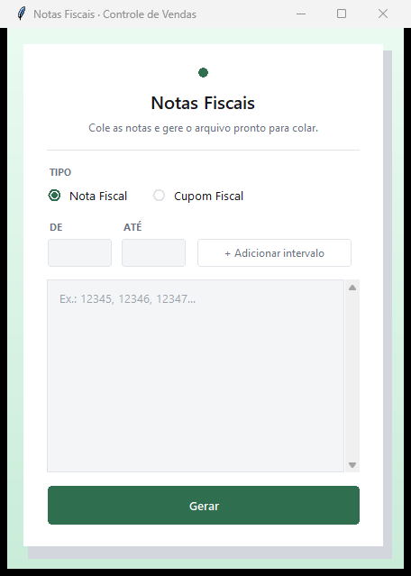
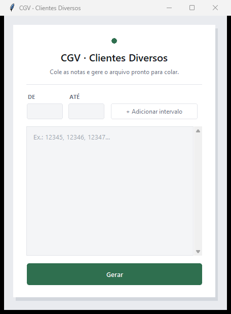
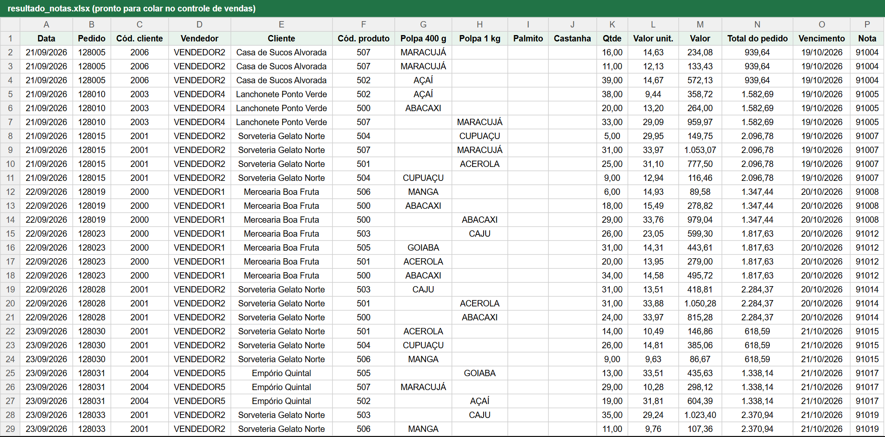
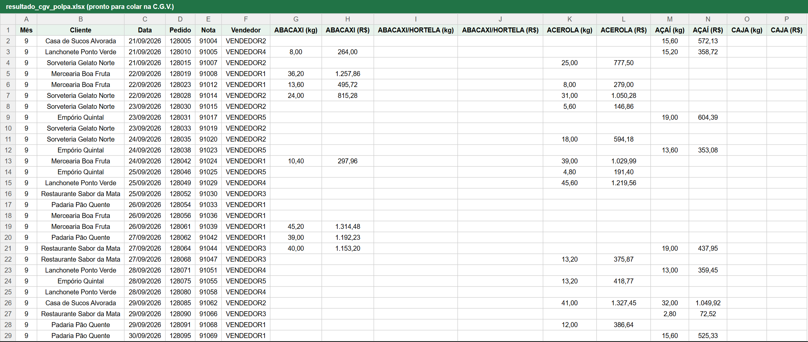

import { Badge, Card, CardGrid } from '@astrojs/starlight/components';

  <Badge text="Em uso" variant="success" size="large" />

## Em uma frase

**A partir do número das notas ou cupons, gera a planilha pronta para o controle de vendas do Comercial e para a C.G.V. da Cobrança, sem digitação.**

Até 50 pedidos por dia eram inseridos à mão nos controles dos setores. O sistema elimina a digitação e os erros que ela gerava, no Comercial e na Cobrança.

## Antes e depois

<CardGrid>
  <Card title="Antes" icon="information">
    Cada cupom ou nota fiscal é inserido à mão no controle de vendas do Comercial e na C.G.V. da Cobrança, e esses registros alimentam consultas futuras e a ficha de comissão.
  </Card>
  <Card title="Depois" icon="approve-check">
    Cada setor informa os números das notas ou cupons e recebe uma planilha pronta para colar, no formato do seu controle, sem digitar nada.
  </Card>
</CardGrid>

## Linha do tempo

| Quando | O que aconteceu |
|---|---|
| **27/07/2026** | Planilhas de referência reunidas |
| **ago/2026** | Primeira versão do aplicativo |
| **22/09/2026** | Versão CGV ganha suporte a castanha, além de palmito e polpa |
| **set/2026** | Em uso, aplicativo instalado nos computadores dos setores |

## Pontos fortes

<CardGrid>
  <Card title="Um lote de cada vez" icon="document">
    Dezenas de notas ou cupons entram juntos, um a um, em lista ou por intervalo, e saem em uma só planilha, em vez de um lançamento por vez.
  </Card>
  <Card title="Dados sem retrabalho" icon="pencil">
    Os dados vêm da aba DADOS do Controle de Saída, então não sobra número copiado à mão para errar, nem para atrapalhar consultas futuras e a ficha de comissão.
  </Card>
  <Card title="Sempre no mesmo padrão" icon="laptop">
    Do primeiro ao último pedido, tudo sai no formato do controle do setor, sem variar de uma pessoa para outra nem de um dia para o outro.
  </Card>
  <Card title="Nada duplicado, nada perdido" icon="approve-check-circle">
    Cada nota mantém todos os seus itens, e as notas já lançadas não são duplicadas.
  </Card>
</CardGrid>

## O que ele faz

**Versão Notas Fiscais (Comercial):** recebe números de notas ou cupons (um a um, em lista ou por intervalo) e monta a planilha com as colunas do controle de vendas.

**Versão CGV (Cobrança):** a partir dos números de nota, monta a planilha da C.G.V. de Clientes Diversos, uma para cada produto: polpa, palmito e castanha.

**Nas duas versões:** lê a aba DADOS do Controle de Saída (planilha online) diretamente, sem exportar nem copiar dados, e gera um arquivo `.xlsx` pronto para copiar e colar.

O sistema **não calcula nem gera a comissão**, só alimenta os controles com dados corretos.

## Quem está por trás

<CardGrid>
  <Card title="Quem pediu" icon="pencil">
    Iniciativa do desenvolvedor.
  </Card>
  <Card title="Quem usa" icon="laptop">
    **Comercial Polpa**, com a sua versão.

    **Cobrança**, com a sua versão.
  </Card>
  <Card title="Quem construiu" icon="rocket">
    **Lucas Castro**, T.I.
    Nível técnico: Fullstack Pleno
  </Card>
  <Card title="Até quando" icon="information">
    Temporário: depende da aba DADOS do Controle de Saída, alimentada pelo Meta Pipeline, até a troca para o TOTVS (01/01/2027).
  </Card>
</CardGrid>

## Telas do sistema

Versão Notas Fiscais:

Versão CGV (Clientes Diversos):

*As telas de entrada não têm dados de clientes. O resultado é uma planilha `.xlsx`.*

## Planilhas geradas

Resultado da versão Notas Fiscais: uma linha por item, no formato do controle de vendas do Comercial, pronta para colar:

Resultado da versão CGV (polpa): uma linha por nota, com quilos e valor de cada sabor, no formato da C.G.V. da Cobrança (trecho das colunas):

*Exemplos com dados fictícios (clientes, vendedores e valores inventados), calculados pelo próprio sistema. A planilha gerada não traz cabeçalho, porque cola direto no controle do setor; os títulos das colunas foram acrescentados aqui só para leitura.*

## Planilhas relacionadas

Controle de Saída (aba DADOS), controle de vendas do Comercial e C.G.V. da Cobrança (polpa, palmito e castanha).
