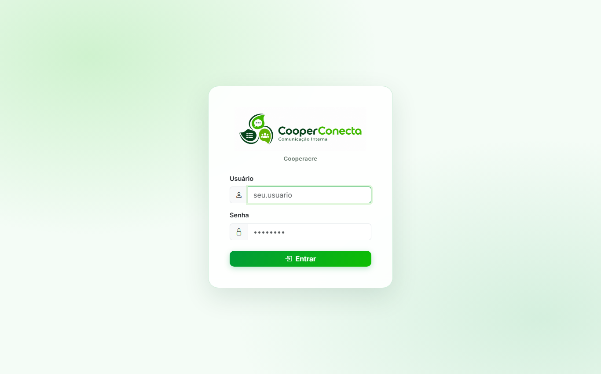
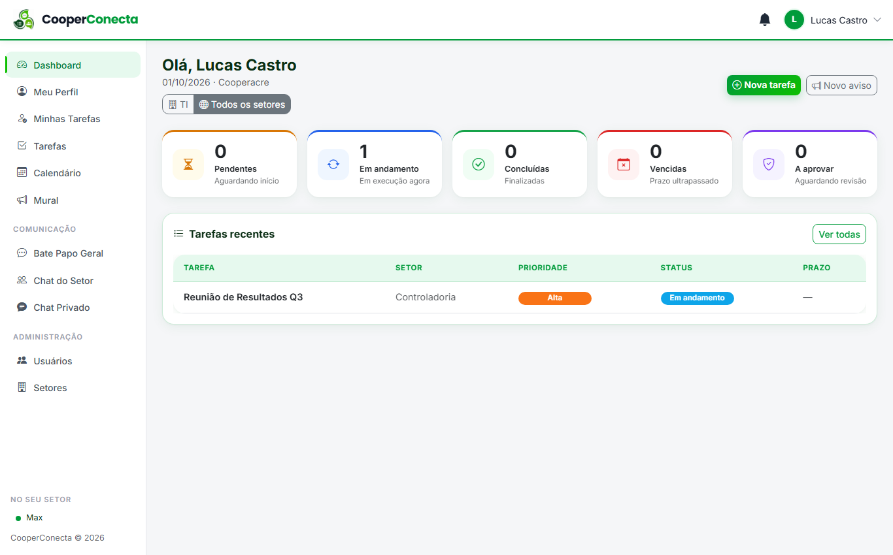
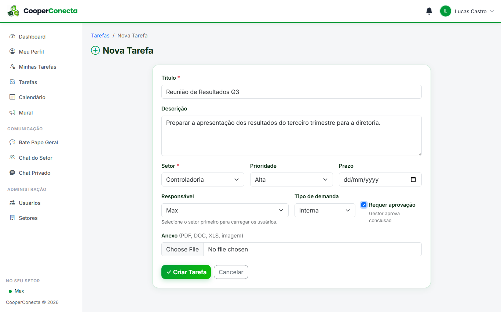
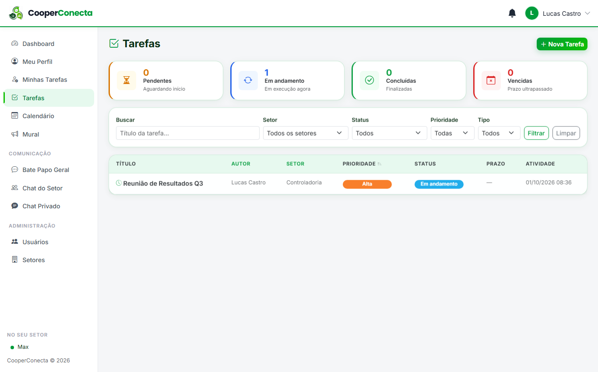
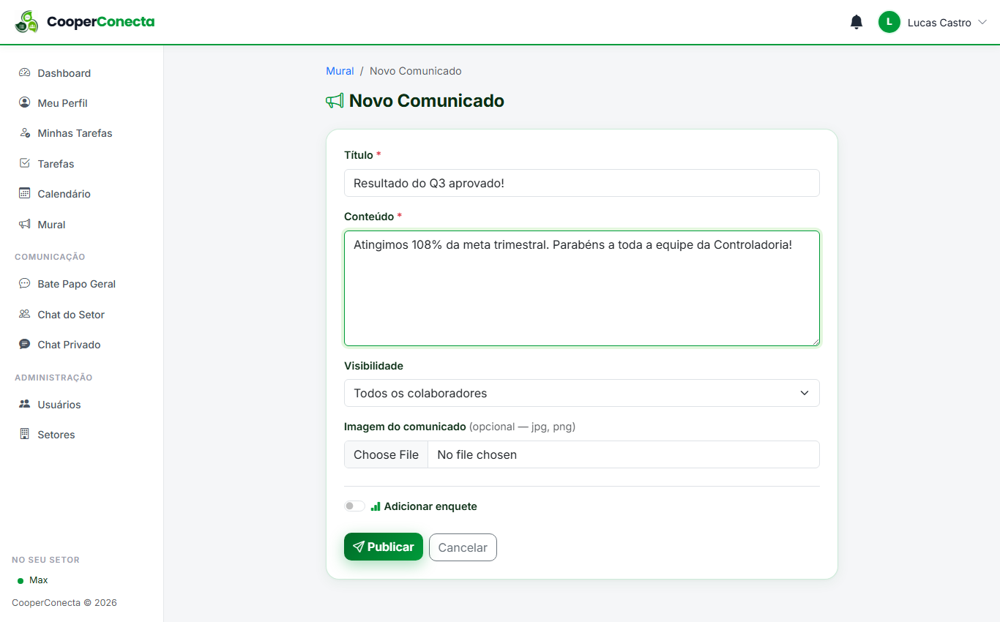
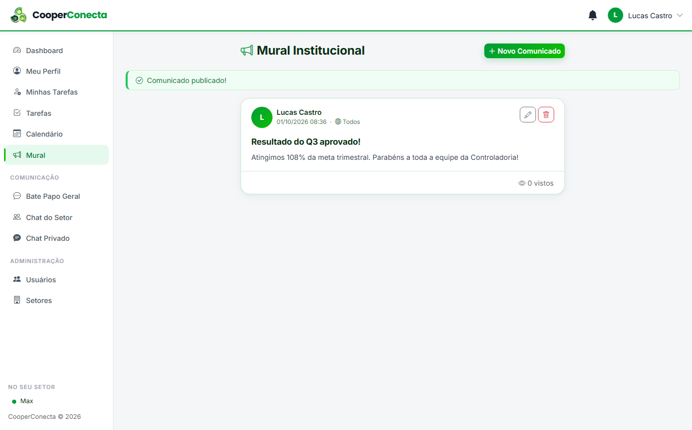
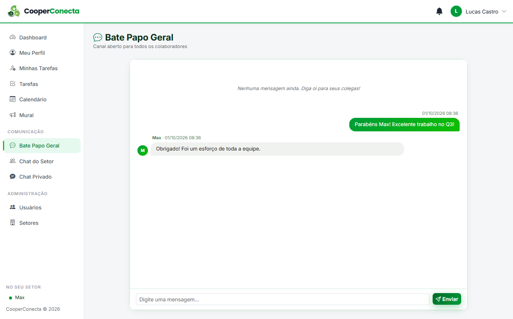
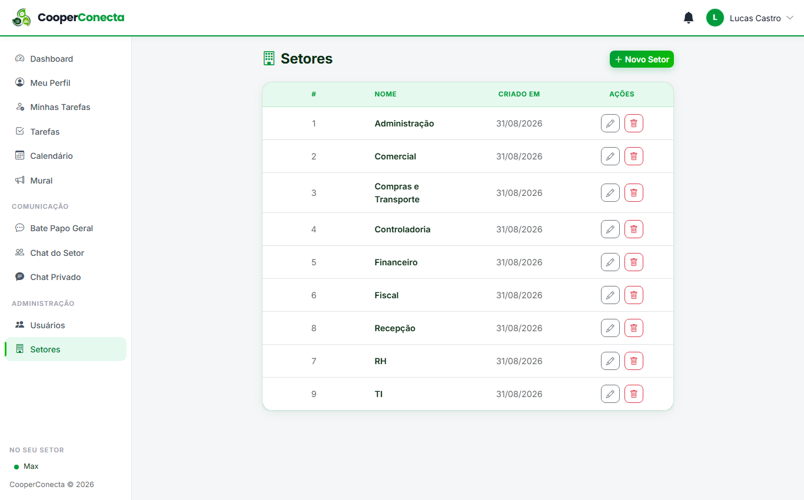

import { Badge, Card, CardGrid } from '@astrojs/starlight/components';

  <Badge text="Pronto para uso" variant="success" size="large" />
  <Badge text="Aguardando apresentação aos setores" variant="caution" size="large" />

## Em uma frase

**Um lugar único para os setores trocarem tarefas, avisos e mensagens, com prazo, anexos, mural e chat, sem depender de conversa espalhada.**

## Antes e depois

<CardGrid>
  <Card title="Antes" icon="warning">
    Tarefa e aviso entre setores se perdem em conversa de WhatsApp, e-mail e corredor, sem prazo visível nem histórico central.
  </Card>
  <Card title="Depois" icon="approve-check">
    Tarefas com prazo e anexo, mural com controle de quem leu, chat por setor e mensagem direta, tudo num só lugar.
  </Card>
</CardGrid>

## Linha do tempo

| Quando | O que aconteceu |
|---|---|
| **jun/2026** | Pedido de Edinar, gerente administrativa. Início do desenvolvimento |
| **fim de jun/2026** | Pronto para uso inicial e validação |
| **set/2026** | Aguardando apresentação aos setores |
| **Próximo passo** | Apresentação do sistema aos setores e início do uso com um grupo inicial |

## Pontos fortes

<CardGrid>
  <Card title="Tarefas entre setores" icon="approve-check-circle">
    Qualquer usuário cria tarefas para qualquer setor, com prazo, anexos e comentários. Mudanças de prazo ficam registradas, e cada pessoa tem sua lista de "minhas tarefas".
  </Card>
  <Card title="Mural com controle de leitura" icon="pencil">
    Publicações com imagem, controle de quem leu (visível para gestores) e enquetes com votação.
  </Card>
  <Card title="Chat em três níveis" icon="laptop">
    Conversa geral, chat por setor e mensagens diretas entre duas pessoas, com contagem de não lidas.
  </Card>
  <Card title="Perfis de acesso" icon="setting">
    Administrador, gestor e usuário. O administrador gerencia usuários e setores.
  </Card>
</CardGrid>

## O que ele faz

- **Tarefas entre setores**, com prazo, anexos e comentários
- **Mural de avisos**, com imagem, controle de leitura e enquetes
- **Chat**: geral, por setor e direto
- **Calendário** de eventos
- **Notificações** e indicação de presença (quem está online)
- **Perfil pessoal** com foto

## O que falta para entrar em uso

1. Apresentação do sistema aos setores
2. Início do uso e validação com um grupo inicial
3. Ajustes a partir do retorno dos usuários e liberação para todos os setores

## Quem está por trás

<CardGrid>
  <Card title="Quem pediu" icon="pencil">
    **Edinar**, gerente administrativa.
  </Card>
  <Card title="Quem vai usar" icon="laptop">
    Previsto para todos os setores.
  </Card>
  <Card title="Quem construiu" icon="rocket">
    **Lucas Castro**, T.I.
    Nível técnico: Fullstack Pleno
  </Card>
  <Card title="Até quando" icon="information">
    Evolui conforme a necessidade, previsto para uso contínuo.
  </Card>
</CardGrid>

## Telas do sistema

*Todos os prints usam dados de exemplo.*

**Acesso:** entrada com usuário e senha.

**Painel:** visão geral das tarefas do setor (ou de todos os setores), com contadores de pendentes, em andamento, concluídas, vencidas e a aprovar.

**Nova tarefa:** título, descrição, setor, prioridade, prazo, responsável, tipo de demanda, anexo e, se necessário, aprovação do gestor na conclusão.

**Lista de tarefas:** todas as tarefas com busca e filtros por setor, status, prioridade e tipo.

**Mural:** comunicados para todos os colaboradores ou para um grupo, com imagem opcional e enquete.

**Chat:** canal aberto a todos os colaboradores, além de conversa por setor e privada.

**Administração de setores:** cadastro dos setores da empresa, gerenciado pelo administrador.

