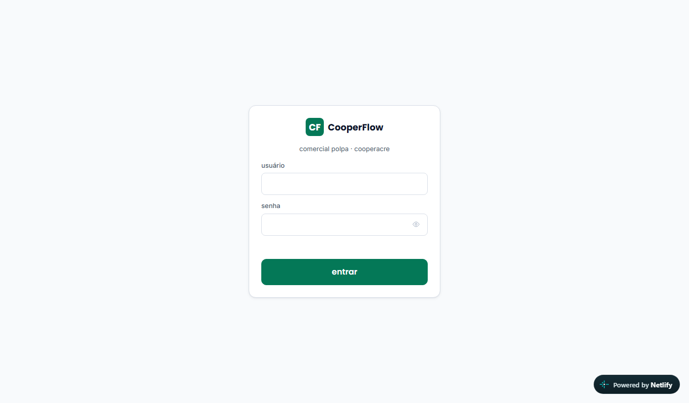
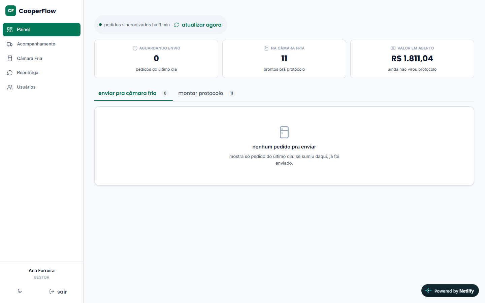
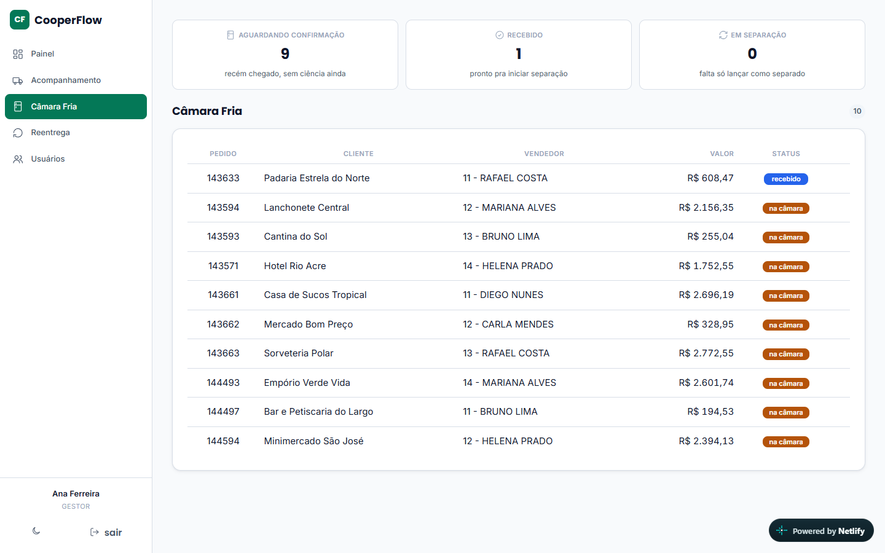
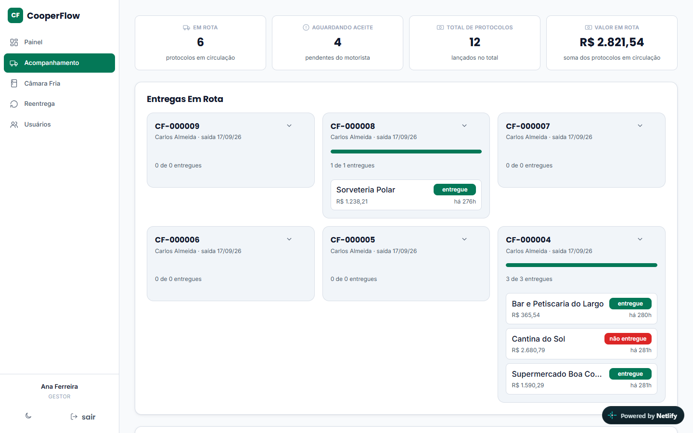
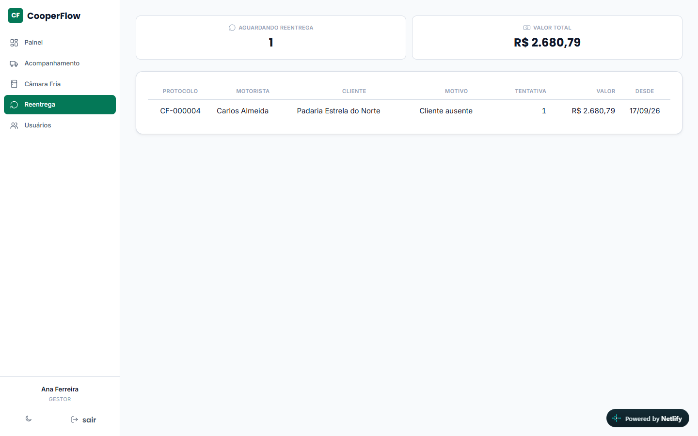
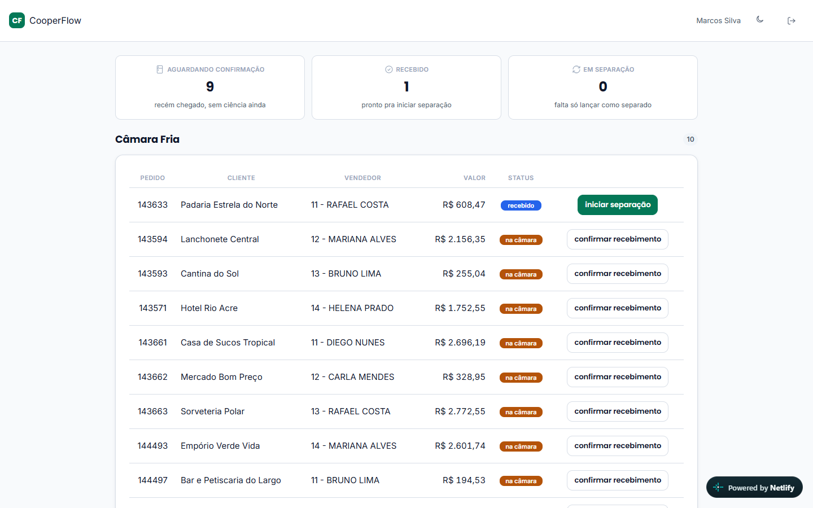
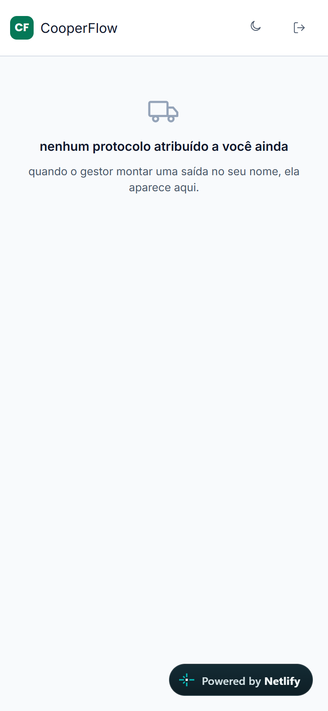

import { Badge, Card, CardGrid } from '@astrojs/starlight/components';

  <Badge text="Em desenvolvimento" variant="caution" size="large" />
  <Badge text="Ainda não lançado" variant="note" size="large" />

## Em uma frase

**Gestão completa do pedido de polpa, em todas as etapas: lançamento, câmara fria, separação, protocolo de entrega, baixa do motorista e conferência do gestor, com status em tempo real para os gestores e, como objetivo, relatórios de performance da operação.**

## Antes e depois

<CardGrid>
  <Card title="Antes" icon="information">
    O pedido passa pela câmara fria, pela separação, pelo protocolo de entrega e pela prestação de contas do motorista, acompanhado pelo Controle de Saída e pelo protocolo impresso.
  </Card>
  <Card title="Depois" icon="approve-check">
    Cada etapa, da câmara fria à conferência do gestor, ganha um status visível para todos em tempo real, e cada perfil usa uma tela feita para o seu trabalho.
  </Card>
</CardGrid>

## Linha do tempo

| Quando | O que aconteceu |
|---|---|
| **set/2026** | Início do desenvolvimento |
| **Próximo passo** | Concluir o desenvolvimento, definir a data de lançamento e treinar as equipes |

## Pontos fortes

<CardGrid>
  <Card title="Uma tela para cada perfil" icon="laptop">
    O gestor usa o computador; a câmara fria e o motorista usam o celular. Cada tela é projetada para quem vai usá-la, não uma interface única forçada para os três.
  </Card>
  <Card title="Fila da câmara fria" icon="setting">
    Pedidos do dia, de amanhã, futuros, sem data e já separados, com cupom de separação para impressão e aviso de pedido parado há muito tempo.
  </Card>
  <Card title="Fechamento só com tudo conferido" icon="approve-check-circle">
    O gestor confere cada pedido baixado pelo motorista, e o protocolo só é fechado quando tudo foi revisado. Um pedido não entregue continua no protocolo até ser corrigido, e nada fica solto.
  </Card>
  <Card title="Trilha de auditoria" icon="pencil">
    Cada mudança importante, como data de expedição, baixa e conferência, fica registrada com quem fez e quando.
  </Card>
</CardGrid>

## O que ele faz

- **Envio para a câmara fria:** o gestor programa a data de expedição e o pedido entra na fila de separação
- **Calendário de expedição:** visão semanal dos pedidos e da quantidade de itens por dia
- **Protocolos de entrega:** montados pelo gestor, aceitos pelo motorista pedido a pedido
- **Acompanhamento ao vivo:** entregas em rota, quanto já foi baixado, valor em circulação
- **Baixa por pedido:** entregue (com forma de pagamento) ou não entregue (com motivo)
- **Reentrega:** pedidos que voltam ficam destacados até serem entregues
- **Documentação e remessa** dos itens entregues

O sistema **não lança pedido nem emite nota**: acompanha o pedido desde o lançamento e cuida do que acontece depois. Complementa a planilha Controle de Saída e o protocolo de entrega impresso, que continuam convivendo com o sistema.

## Perfis de acesso

Três telas diferentes, uma para cada papel, cada uma só com o que aquela pessoa precisa:

**Gestor** (computador): programa a data de expedição de cada pedido, monta o calendário semanal, monta o protocolo de entrega do motorista e acompanha ao vivo as entregas em rota e o valor em circulação.

**Câmara fria** (celular): recebe a fila de separação (pedidos de hoje, de amanhã, futuros e sem data), imprime o cupom de separação, é avisada quando um pedido fica parado há muito tempo, e documenta a remessa dos itens entregues.

**Motorista** (celular): aceita o protocolo de entrega pedido a pedido e dá baixa em cada um, entregue (com forma de pagamento) ou não entregue (com motivo). Pedidos de reentrega ficam destacados até serem entregues de verdade.

## O que falta para lançar

1. Concluir o desenvolvimento
2. Definir a data de lançamento
3. Treinamento das equipes (gestor, câmara fria, motorista)

## Quem está por trás

<CardGrid>
  <Card title="Quem pediu" icon="pencil">
    **Kássio**, gestor comercial.

    **Paulo**, gestor de polpas.

    Solicitado a partir do fluxo de saída acompanhado no Controle de Saída.
  </Card>
  <Card title="Quem vai usar" icon="laptop">
    **Gestores**: computador.

    **Equipe da câmara fria**: celular.

    **Motoristas**: celular.
  </Card>
  <Card title="Quem construiu" icon="rocket">
    **Lucas Castro**, T.I.
    Nível técnico: Fullstack Pleno
  </Card>
  <Card title="Até quando" icon="information">
    Temporário: descontinuação prevista com a troca do Meta pelo TOTVS (go live em 01/01/2027).
  </Card>
</CardGrid>

## Relação com outros sistemas

Recebe os pedidos do Meta, desde o lançamento (inclusive os ainda não faturados), por meio do [Meta Pipeline](/catalogo/meta-pipeline/). Complementa a planilha Controle de Saída e o protocolo de entrega, que continuam convivendo com o sistema.

## Telas do sistema

**Acesso (tela de login)**

**Gestor: Painel**, com os totais de pedidos aguardando envio, na câmara fria e valor em aberto:

**Gestor: fila da Câmara Fria**, pedido a pedido, com cliente, vendedor e status:

**Gestor: Acompanhamento**, entregas em rota por motorista, com o que já foi baixado:

**Gestor: Reentrega**, pedidos que voltaram, com motivo e tentativa:

**Câmara fria**: mesma fila do gestor, mas com os botões de ação (confirmar recebimento, iniciar separação):

**Motorista** (celular): lista de protocolos atribuídos a ele; aqui sem nenhum atribuído ainda:

*Todos os prints usam dados fictícios (nomes de cliente e vendedor gerados na hora), gerados navegando o próprio sistema em produção com uma sessão de teste.*

## Planilhas relacionadas

Controle de Saída, a planilha que o sistema complementa (ver a seção de planilhas).
