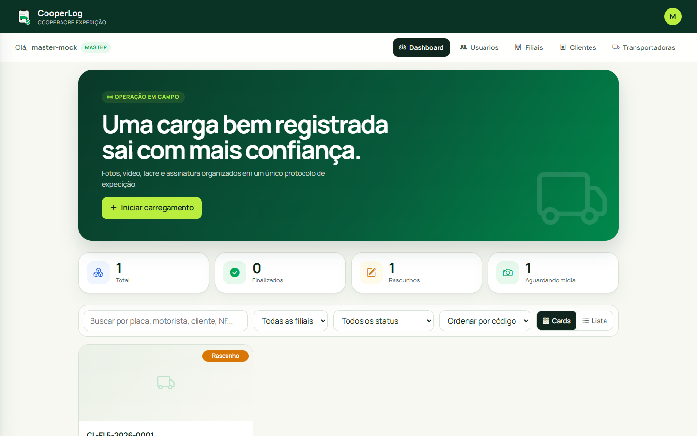
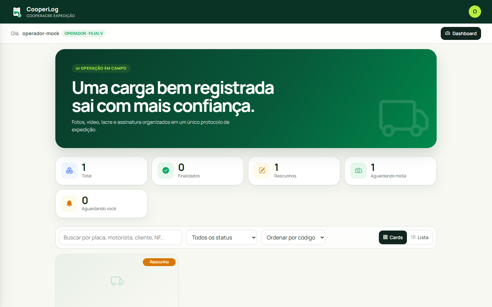
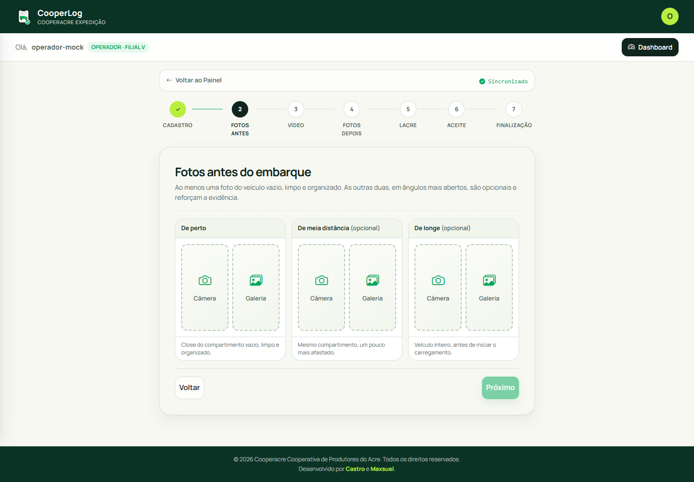
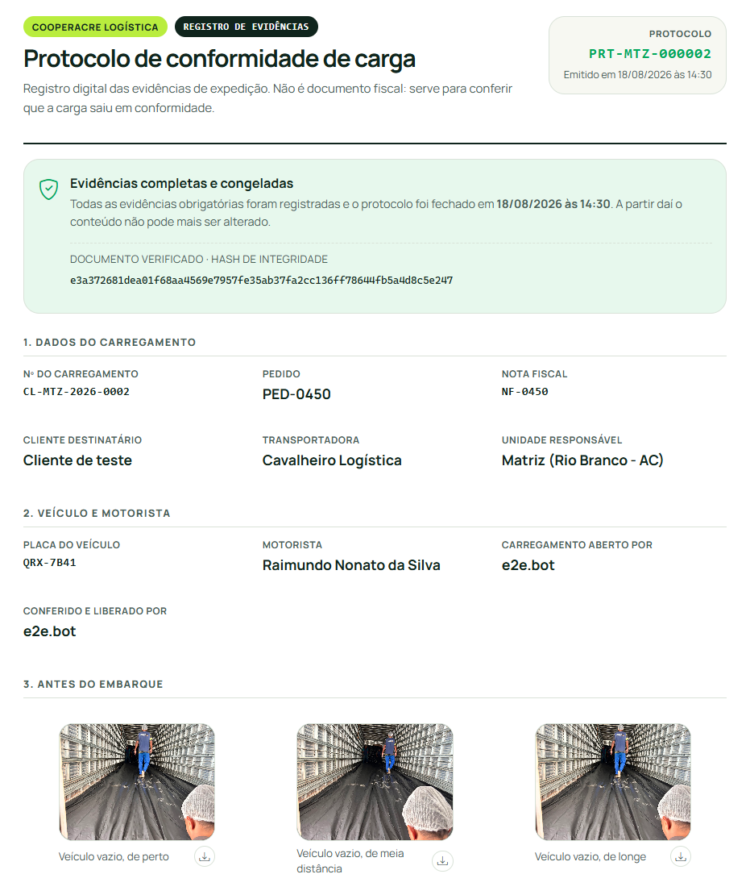
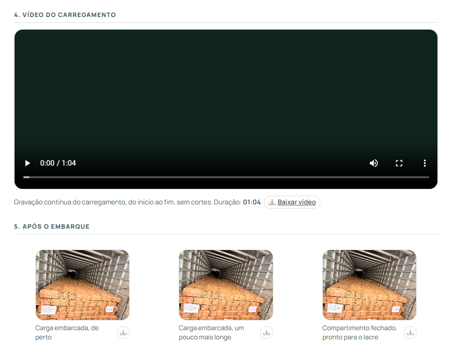
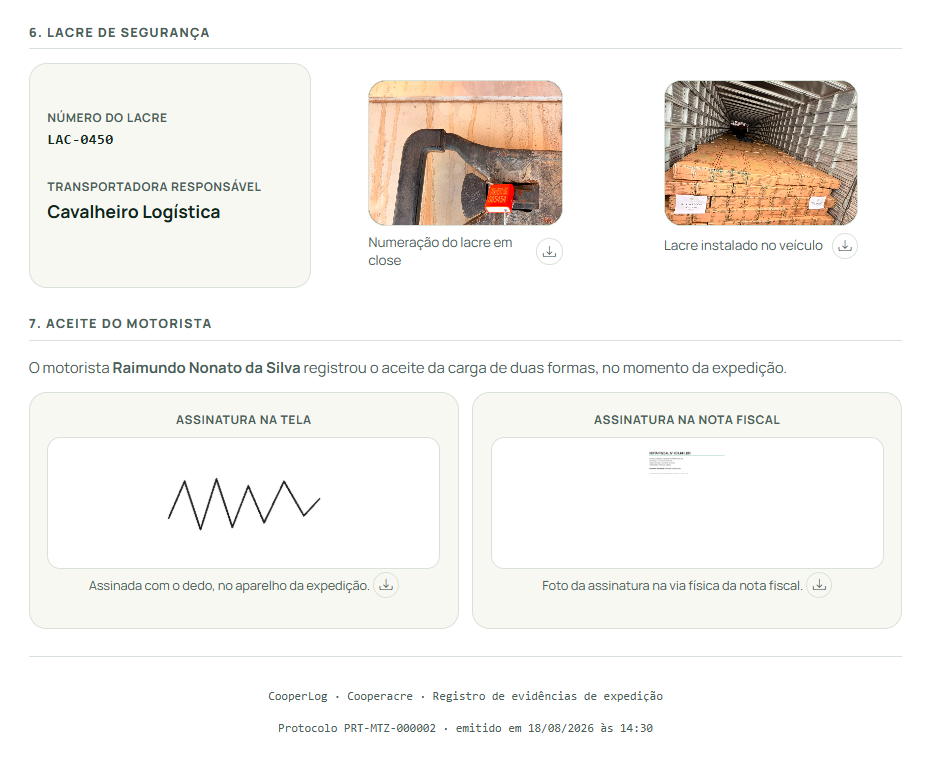
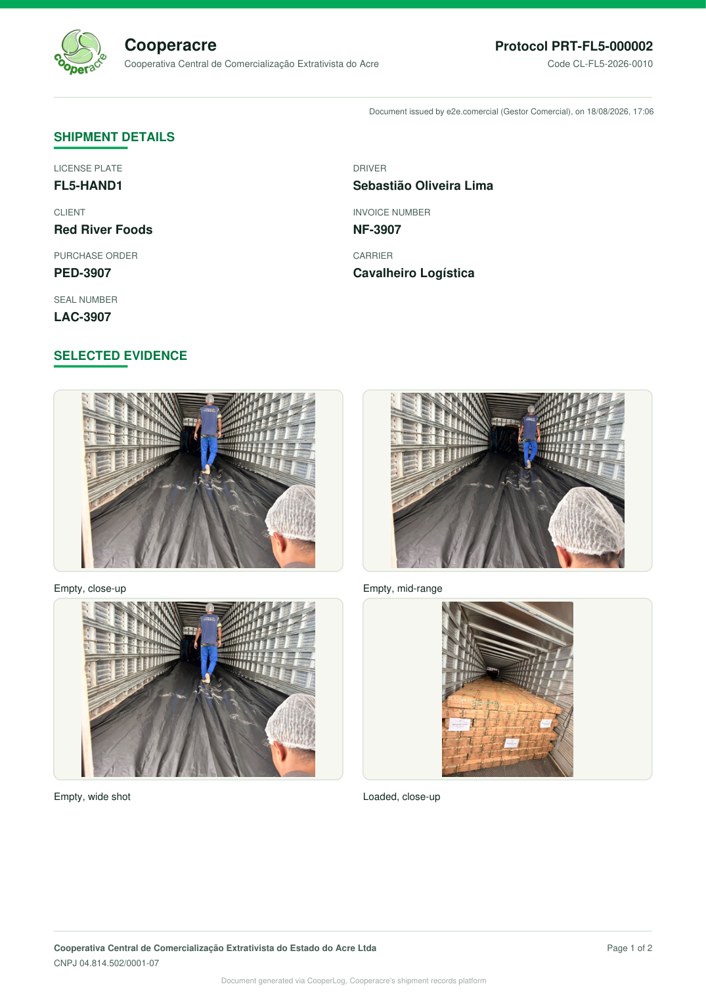
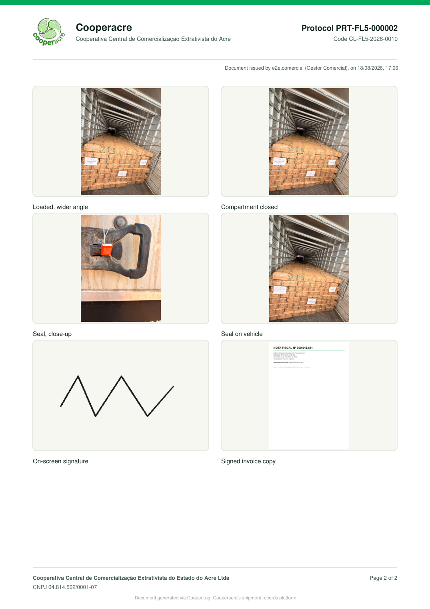

import { Badge, Card, CardGrid } from '@astrojs/starlight/components';

  <Badge text="Pronto para uso" variant="success" size="large" />
  <Badge text="Aguardando decisão de adoção" variant="caution" size="large" />

## Em uma frase

**Cada carregamento que sai da Cooperacre vira um protocolo digital com fotos, vídeo, lacre e assinatura do motorista, que o cliente confere por um link no celular e que ninguém consegue alterar depois de fechado.**

## Antes e depois

<CardGrid>
  <Card title="Antes" icon="information">
    Os embarques são registrados e as fotos e vídeos são enviados pelo WhatsApp, e cada conversa guarda o seu próprio material.
  </Card>
  <Card title="Depois" icon="approve-check">
    Um roteiro de sete etapas guia quem carrega. No fim, sai um protocolo numerado, num link que o cliente abre sem senha, com todo o registro do carregamento reunido em um só lugar.
  </Card>
</CardGrid>

## Linha do tempo

| Quando | O que aconteceu |
|---|---|
| **ago/2026** | Solicitado pelo Kássio, gestor do Comercial, com Maxsuel definindo a aparência, os fluxos e as regras do sistema |
| **03 a 18/08/2026** | Desenvolvimento, testes e ajustes para celular e computador |
| **set/2026** | Solução pronta para uso, com início do uso por Maxsuel |

## Pontos fortes

<CardGrid>
  <Card title="Registro que não pode ser alterado" icon="approve-check-circle">
    Depois de finalizado, o registro do carregamento não pode mais ser editado por ninguém, nem por quem administra o sistema, e qualquer tentativa de mudança seria percebida.
  </Card>
  <Card title="Feito para o pátio" icon="rocket">
    Funciona no celular como um aplicativo, sem loja, e não perde o registro se a internet cair: fotos e vídeo seguem assim que o sinal volta.
  </Card>
  <Card title="Dois responsáveis, nomeados" icon="pencil">
    O registro mostra quem abriu o carregamento e quem conferiu e liberou, cada um identificado pelo nome, o que facilita a conversa com a diretoria e com o cliente.
  </Card>
  <Card title="Cada pessoa vê o que é seu" icon="laptop">
    Cada usuário acessa só o que pertence à sua função e à sua filial.
  </Card>
</CardGrid>

## O que ele faz

**Registro do carregamento**
- Abertura do carregamento com placa, motorista, pedido, nota, cliente e transportadora, numerado por filial
- Registro guiado em sete etapas: cadastro, fotos antes do embarque, vídeo do carregamento, fotos depois, lacre, aceite do motorista e finalização
- Aceite do motorista por assinatura na tela ou por foto da assinatura na nota física

**Protocolo para o cliente**
- Finalização com protocolo numerado por filial, que não pode mais ser alterado
- Página do protocolo para o cliente, sem senha, com todas as evidências
- Mensagem curta pronta para WhatsApp e botão para copiar o link

## Resultados

*O sistema ainda não entrou em rotina, então não há números de uso.* Quando o primeiro mês de uso terminar, esta seção passa a mostrar: carregamentos registrados, tempo médio de registro e reclamações resolvidas com o protocolo.

## O que falta para entrar em uso

1. **Início do uso** por Maxsuel
2. **Treinamento curto** da equipe de expedição
3. **Primeiro carregamento real**, acompanhado pelo desenvolvedor

## Quem está por trás

<CardGrid>
  <Card title="Quem pediu" icon="pencil">
    **Kássio**, gestor do Comercial.
  </Card>
  <Card title="Quem vai usar" icon="laptop">
    A **equipe da Filial V**, **Kássio**, **Maxsuel**, **Ismael** e os **clientes**, que consultam o protocolo.
  </Card>
  <Card title="Quem construiu" icon="rocket">
    **Lucas Castro**, T.I.
    Nível técnico: Fullstack Pleno

    **Maxsuel**, gerente de controladoria, que definiu a aparência, os fluxos e as regras do sistema
    Nível técnico: Padawan
  </Card>
  <Card title="Até quando" icon="information">
    Sem prazo definido. Não depende do sistema de gestão atual, mas ainda não se sabe se o TOTVS cobrirá esse tipo de registro.
  </Card>
</CardGrid>

## Telas do sistema

**Painel geral**, com visão de todas as filiais e os menus de cadastro (usuários, filiais, clientes e transportadoras):

**Painel da filial**, só com a própria filial e sem os menus de cadastro:

**Registro passo a passo** (cadastro, fotos antes, vídeo, fotos depois, lacre, aceite e finalização); aqui parado no passo 2, aguardando as fotos:

*Prints do único carregamento real em teste até agora, ainda em rascunho.*

**Protocolo online**, a página que o cliente abre pelo link, no celular ou no computador, sem senha. Reúne os dados, as fotos de antes e depois, o vídeo do carregamento, o lacre e a assinatura do motorista, com um selo que prova que o conteúdo não foi alterado depois do fechamento:

*Exemplo gerado em teste, com cliente e dados de carregamento fictícios.*

**Protocolo em PDF**, o documento pronto para enviar ao cliente por WhatsApp ou e-mail, sem precisar de link. O sistema monta o PDF com os dados do carregamento e as evidências que o comercial escolher, em português ou em inglês (este exemplo saiu em inglês):

*Exemplo gerado em teste, com cliente e dados de carregamento fictícios.*
