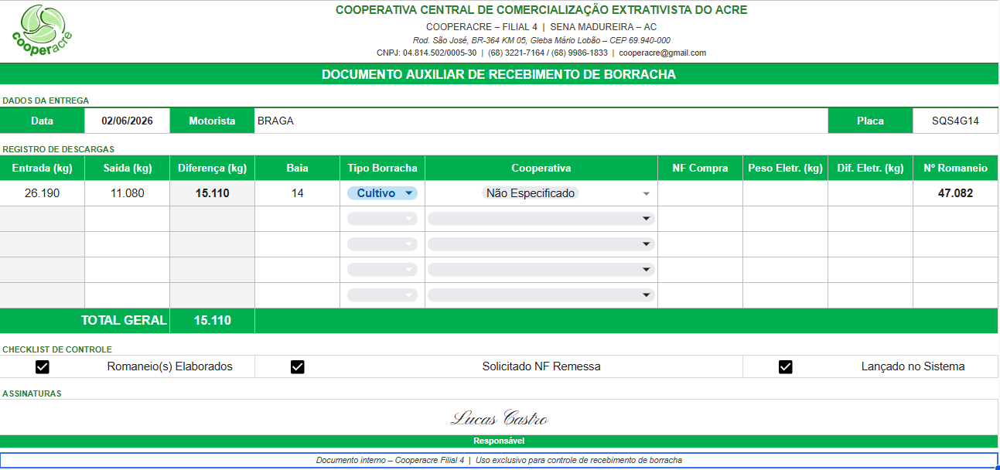

import { Badge, Card, CardGrid } from '@astrojs/starlight/components';

  <Badge text="Em uso" variant="success" size="large" />

## Em uma frase

**Formulário preenchido a cada recebimento de borracha da Filial IV, que garante que pesagem, romaneio, baia, fotos, assinatura e solicitação da nota de remessa foram anotados.**

## Antes e depois

<CardGrid>
  <Card title="Antes" icon="information">
    O recebimento de borracha tem várias etapas (pesagem, romaneio, nota de remessa, lançamento) e é fácil esquecer uma.
  </Card>
  <Card title="Depois" icon="approve-check">
    Um formulário único, com os campos de pesagem, tipo e destino, e um checklist de controle, preenchido durante o recebimento e que pode ser impresso.
  </Card>
</CardGrid>

## Linha do tempo

| Quando | O que aconteceu |
|---|---|
| **jun/2026** | Início, por iniciativa do desenvolvedor, como fase experimental |
| **out/2026** | Em uso, conferido na documentação |

## Pontos fortes

<CardGrid>
  <Card title="Pesagem registrada" icon="approve-check-circle">
    Reúne o peso bruto, a tara e o peso líquido do carregamento, junto com o tipo da borracha e a baia de destino.
  </Card>
  <Card title="Checklist de controle" icon="pencil">
    Lista as etapas do recebimento: foto da borracha, romaneio assinado, solicitação da nota de remessa, lançamento no sistema e arquivo digital.
  </Card>
  <Card title="Imprimível" icon="document">
    O checklist pode ser impresso a partir do Manual Operacional, para quem prefere preencher no papel.
  </Card>
  <Card title="Dentro do recebimento" icon="rocket">
    É preenchido durante o procedimento de recebimento, logo depois de calcular o peso e identificar o tipo da borracha.
  </Card>
</CardGrid>

## O que ele faz

- Registra data, cooperativa de origem, tipo da borracha (Prancha, Biscoito ou Cultivo) e número do romaneio
- Registra peso bruto, tara e peso líquido calculado, a baia de destino e o motorista
- Confere foto da borracha, romaneio assinado, solicitação da nota de remessa, lançamento no sistema e arquivo digital

## Quem está por trás

<CardGrid>
  <Card title="Quem pediu" icon="pencil">
    Iniciativa do desenvolvedor.
  </Card>
  <Card title="Quem usa" icon="laptop">
    **A equipe da Filial IV**, em cada recebimento de borracha.
  </Card>
  <Card title="Quem construiu" icon="rocket">
    **Lucas Castro**, T.I.
    Nível técnico: Fullstack Pleno
  </Card>
  <Card title="Até quando" icon="information">
    Acompanha o procedimento de recebimento da filial. Não depende do sistema de gestão da cooperativa.
  </Card>
</CardGrid>

## Telas do sistema

Formulário preenchido:

## Planilhas relacionadas

Faz parte do procedimento de recebimento de borracha, descrito no [Manual Operacional](/catalogo/manual-filial-iv/), e é uma das planilhas de apoio da [Planilha de Contrato](/catalogo/planilha-contrato-filial-iv/).

