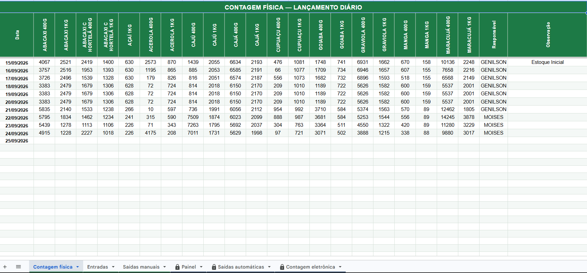
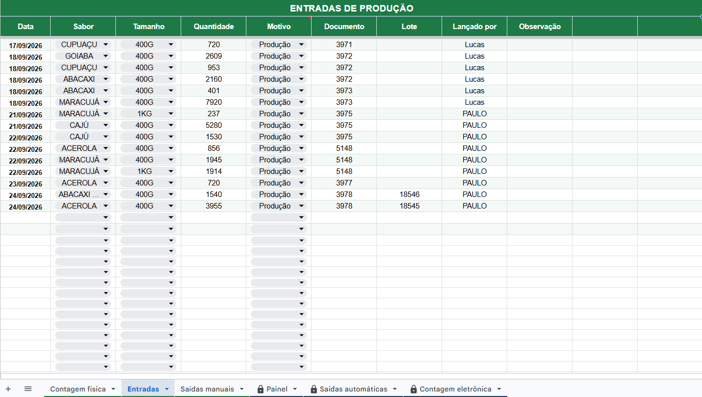
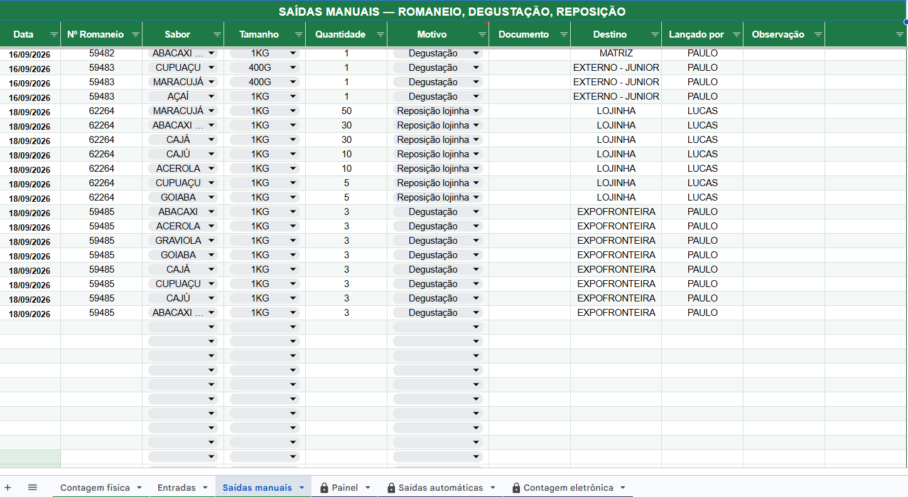
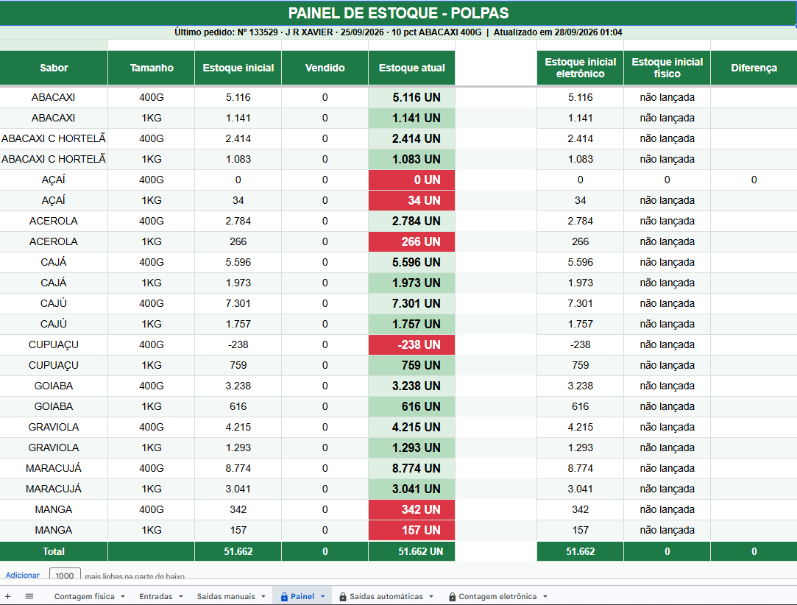
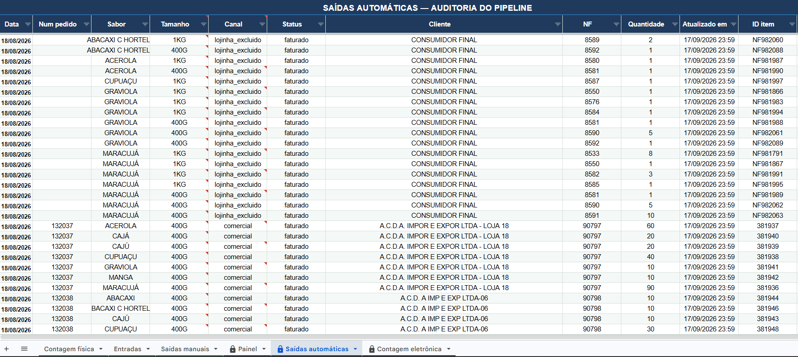
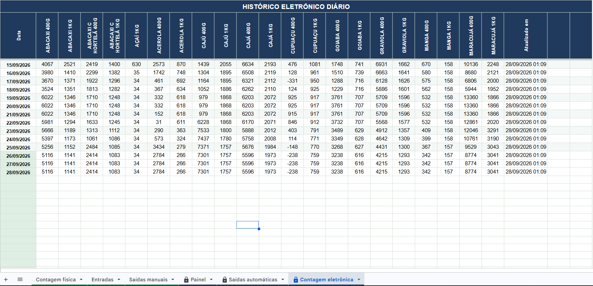

import { Badge, Card, CardGrid } from '@astrojs/starlight/components';

  <Badge text="Em uso" variant="success" size="large" />

## Em uma frase

**Mostra o saldo de estoque de polpa dia a dia, funcionando como um livro-razão: parte de uma base confiável e, dali em diante, entrada soma e saída subtrai, sem depender de contagem física constante.**

A contagem física só confere o cálculo, nunca o reescreve.

## Antes e depois

<CardGrid>
  <Card title="Antes" icon="information">
    O estoque é lançado manualmente, com movimentação interna entre unidades e um atraso natural de cerca de 1 dia entre a saída física e o faturamento no Meta, o que deixa o número eletrônico defasado para o planejamento de vendas e a solicitação de produção.
  </Card>
  <Card title="Depois" icon="approve-check">
    Saldo calculado automaticamente, atualizado a cada poucos minutos, com alerta visual quando um sabor zera ou fica negativo, e a contagem física só como conferência.
  </Card>
</CardGrid>

## Linha do tempo

| Quando | O que aconteceu |
|---|---|
| **ago/2026** | Início do desenvolvimento, pedido de Kássio e Paulo (setor comercial) |
| **15/09/2026** | Lançamento oficial |
| **set/2026** | Em uso: conferido pela manhã e repassado à equipe de vendedores |

## Pontos fortes

<CardGrid>
  <Card title="Livro-razão, não recontagem" icon="approve-check-circle">
    Entrada soma, saída subtrai, a partir de uma base que só avança por comando explícito. A contagem física é conferência, nunca reescreve o cálculo.
  </Card>
  <Card title="Comercial sem lançamento à mão" icon="rocket">
    Saída do canal comercial chega via [Meta Pipeline](/catalogo/meta-pipeline/). Romaneio institucional, lojinha e transferência entre unidades são lançados manualmente pela equipe, na aba Saídas manuais.
  </Card>
  <Card title="Eletrônico x físico, lado a lado" icon="setting">
    O Painel mostra as duas colunas juntas e a diferença entre elas, pra achar rápido onde o número parou de bater.
  </Card>
  <Card title="Entrada sem esperar a nota" icon="pencil">
    A produção entra pelo número do documento interno, sem esperar a nota fiscal de faturamento (que pode atrasar).
  </Card>
</CardGrid>

## Como funciona o Painel

O Painel é uma tabela, uma linha por sabor e tamanho, com o topo mostrando o último pedido lançado e a hora da última atualização (poucos minutos de atraso). As colunas:

- **Estoque inicial**: o ponto de partida do cálculo, definido por comando explícito.
- **Vendido**: soma das saídas desde o estoque inicial (pedidos do Meta por canal, mais as saídas manuais).
- **Estoque atual**: estoque inicial menos vendido, o número que o comercial usa no dia a dia. Fica destacado em verde quando positivo e em vermelho quando zerado ou negativo (alerta visual de ruptura).
- **Estoque inicial eletrônico** e **Estoque inicial físico**: o mesmo ponto de partida, um lado calculado e o outro vindo da contagem física manual, lado a lado para comparar.
- **Diferença**: eletrônico menos físico, pra achar rápido onde o número parou de bater.

Abas de apoio, uma para cada tipo de lançamento que alimenta o cálculo: **Contagem física** (lançamento diário da equipe), **Entradas** (produção pelo documento interno), **Saídas manuais** (romaneio de degustação, reposição da lojinha, saída externa), **Saídas automáticas** (auditoria do que o Meta Pipeline trouxe do Meta) e **Contagem eletrônica** (histórico do fechamento diário).

## Regras que valem conhecer

- A base do cálculo só avança por comando explícito
- O pedido já desconta do saldo no dia em que é feito (não existe coluna de reservado)
- Transferência entre unidades e romaneio não contam como venda

## Quem está por trás

<CardGrid>
  <Card title="Quem pediu" icon="pencil">
    **Kássio** e **Paulo**, setor comercial.
  </Card>
  <Card title="Quem usa" icon="laptop">
    **Paulo**, gestor de polpas: confere o estoque pela manhã.

    **Equipe de vendedores**: recebe o estoque disponível.
  </Card>
  <Card title="Quem construiu" icon="rocket">
    **Lucas Castro**, T.I.
    Nível técnico: Fullstack Pleno
  </Card>
  <Card title="Até quando" icon="information">
    Temporário: descontinuação prevista com a troca do Meta pelo TOTVS (go live em 01/01/2027).
  </Card>
</CardGrid>

## Telas do sistema

Na ordem das abas da planilha:

Aba Contagem física: lançamento diário da equipe, sabor a sabor.

Aba Entradas: registro da produção pelo documento interno, sem esperar a nota fiscal.

Aba Saídas manuais: romaneio de degustação, reposição da lojinha e saída externa.

Aba Painel: o resumo principal, com estoque inicial, vendido, estoque atual e a comparação eletrônico x físico, por sabor e tamanho.

Aba Saídas automáticas: auditoria do que o Meta Pipeline trouxe do Meta, pedido a pedido.

Aba Contagem eletrônica: histórico do fechamento eletrônico diário, usado para comparar com a contagem física.

## Planilhas relacionadas

Planilha Google com a aba Painel de estoque.
