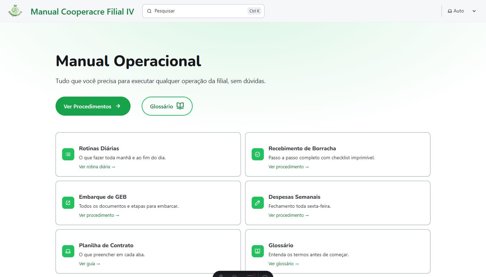

## Visão geral

| Campo | Informação |
|---|---|
| **Nome de exibição** | Filial IV |
| **Pasta / repositório** | `cooperacre4-manual` |
| **Finalidade** | Reunir o que a Filial IV tem documentado: o manual operacional já descreve as rotinas, a planilha de contrato e o webapp da filial (instalável no celular como aplicativo ou acessível pelo navegador). |
| **Quem solicitou** | Iniciativa do desenvolvedor (Lucas Castro) |
| **Quem usa** | Funcionários da Filial IV |
| **Situação** | Em uso (manual da Filial IV) |
| **Vida útil** | Atualiza conforme a necessidade |
| **Responsável técnico** | Lucas Castro, T.I. Nível técnico: Fullstack Pleno |

:::note
Manual da Filial IV: [cooperacre4-manual.netlify.app](https://cooperacre4-manual.netlify.app/)
:::

## Para que serve

A documentação da Filial IV vive no manual da própria filial: um projeto isolado, com site e publicação próprios. Este catálogo apenas aponta para ela, para não duplicar informação.

O manual nasceu de iniciativa própria, com um objetivo direto: permitir que qualquer pessoa executasse as tarefas operacionais da filial, inclusive na ausência de quem normalmente as faz, e facilitar o treinamento de quem assumisse a operação depois.

## O que ele faz

- Manual da Filial IV: rotinas, procedimentos, glossário e checklists
- Planilha de contrato: o que é e o que cada aba faz
- Webapp da filial (instalável no celular ou acessível pelo navegador): seções e como ler
- Outras filiais entram no menu Filiais quando tiverem documentação

## Telas do sistema

**Página inicial do Manual Operacional da Filial IV**, com acesso direto às rotinas diárias, aos procedimentos (recebimento de borracha, embarque de GEB, despesas semanais), à planilha de contrato e ao glossário:

## Planilhas relacionadas

Descritas dentro do manual da Filial IV.

## Soluções da Filial IV

Cada solução da filial tem a sua ficha:

- [Webapp Filial IV: versão Veja](/catalogo/webapp-filial-iv-veja/), o painel que o cliente acompanha
- [Webapp Filial IV: hub interno](/catalogo/webapp-filial-iv-interno/), o painel completo da equipe
- [Planilha de Contrato](/catalogo/planilha-contrato-filial-iv/), que registra a operação e alimenta os painéis
- [DARB](/catalogo/darb-filial-iv/), o formulário do recebimento de borracha
- [Relação de Despesas](/catalogo/relacao-despesas-filial-iv/), o fechamento semanal
- [Manual Operacional](/catalogo/manual-filial-iv/), que documenta as rotinas e os procedimentos
