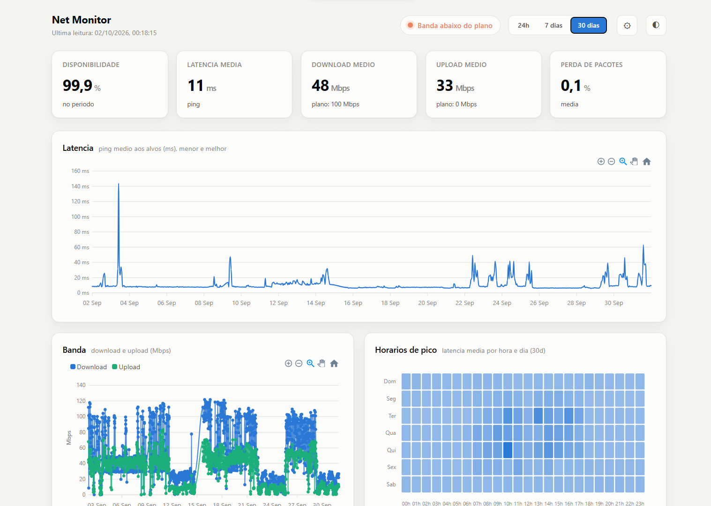
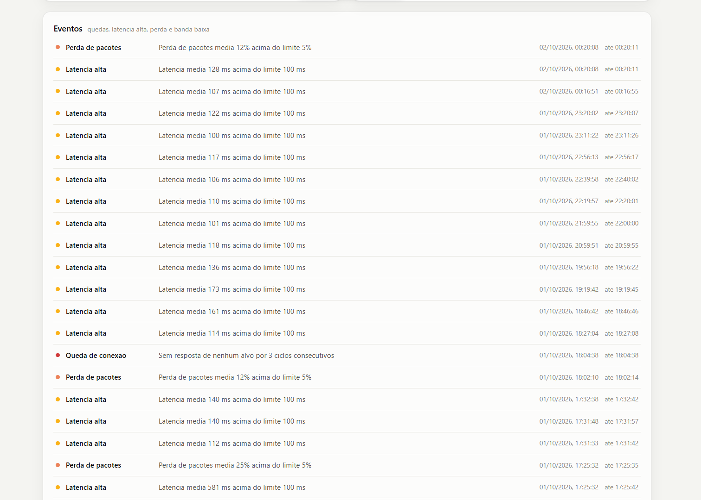

import { Badge, Card, CardGrid } from '@astrojs/starlight/components';

  <Badge text="Em uso" variant="success" size="large" />

## Em uma frase

**Monitora a rede local o tempo todo, mostrando latência, perda de pacotes, oscilação e velocidade num painel de leitura executiva, em vez de um teste avulso que não mostra microquedas nem horário de pico.**

Sem depender dos dados do contrato de internet, o sistema estima, com medições reais, a capacidade e a qualidade da conexão.

## Antes e depois

<CardGrid>
  <Card title="Antes" icon="information">
    A velocidade da internet é medida em testes avulsos, que mostram um instante e não registram microquedas, picos de latência nem horários de sobrecarga ao longo do tempo.
  </Card>
  <Card title="Depois" icon="approve-check">
    Medição contínua, de dentro da própria rede, com histórico e alertas calibrados pela referência da regulamentação de banda larga.
  </Card>
</CardGrid>

## Linha do tempo

| Quando | O que aconteceu |
|---|---|
| **jul/2026** | Início do desenvolvimento, iniciativa do desenvolvedor, a partir de queixas antigas sobre a internet e dos problemas de desempenho nos primeiros testes do TOTVS web |
| **set/2026** | Em uso pelo T.I., pela rede privada, coletando de forma contínua |

## Pontos fortes

<CardGrid>
  <Card title="Mostra o que o teste avulso não mostra" icon="clock">
    Microquedas, picos de atraso e horários de sobrecarga, registrados ao longo do dia e não só no instante do teste.
  </Card>
  <Card title="Alerta com referência oficial" icon="approve-check-circle">
    Avisa quando a velocidade **média** fica abaixo de 80% da contratada, o mesmo parâmetro que a regulamentação de banda larga fixa usa.
  </Card>
  <Card title="Ajustes pela própria tela" icon="setting">
    Intervalos, velocidade contratada e limites de alerta mudam direto no painel, sem precisar programar.
  </Card>
  <Card title="Histórico que não pesa" icon="bars">
    Os dados antigos são resumidos automaticamente, e o histórico pode crescer por muito tempo.
  </Card>
</CardGrid>

## O que ele faz

- Medição contínua de latência, perda de pacotes e oscilação (jitter)
- Teste de velocidade periódico (download e upload)
- Painel com gráficos e horários de pico
- Alertas visuais para queda de conexão, banda abaixo do contratado e instabilidade

## Como interpretar as medições

As medições descrevem a experiência daquele ponto, naquele momento. Podem diferir em outros pontos por causa de cabeamento, roteadores, Wi-Fi e infraestrutura interna, e por isso não bastam, sozinhas, para responsabilizar o provedor ou a rede interna. Servem para indicar tendências, horários de pico e para decidir onde investigar. O manual não registra conclusões sobre a qualidade da internet, porque elas mudam com o tempo: os resultados vivem no painel.

## Quem está por trás

<CardGrid>
  <Card title="Quem pediu" icon="pencil">
    Iniciativa do desenvolvedor, a partir de queixas antigas da administração (Edinar).
  </Card>
  <Card title="Quem usa" icon="laptop">
    **T.I.**
  </Card>
  <Card title="Quem construiu" icon="rocket">
    **Lucas Castro**, T.I.
    Nível técnico: Fullstack Pleno
  </Card>
  <Card title="Até quando" icon="information">
    Sem prazo definido. Pode crescer conforme a necessidade (ex.: monitorar várias redes da empresa).
  </Card>
</CardGrid>

## Telas do sistema

**Painel**, com disponibilidade, atraso, velocidade e perda de pacotes do período, o gráfico de cada medida e os horários de pico:

*Print ilustrativo de uma medição real. Os valores mudam com o tempo e a velocidade do plano exibida é uma estimativa.*

**Eventos**, a lista de quedas de conexão, atrasos altos, perda de pacotes e banda baixa, cada um com o horário de início e de fim:

*Print ilustrativo de uma medição real. Os eventos mudam conforme a rede.*
