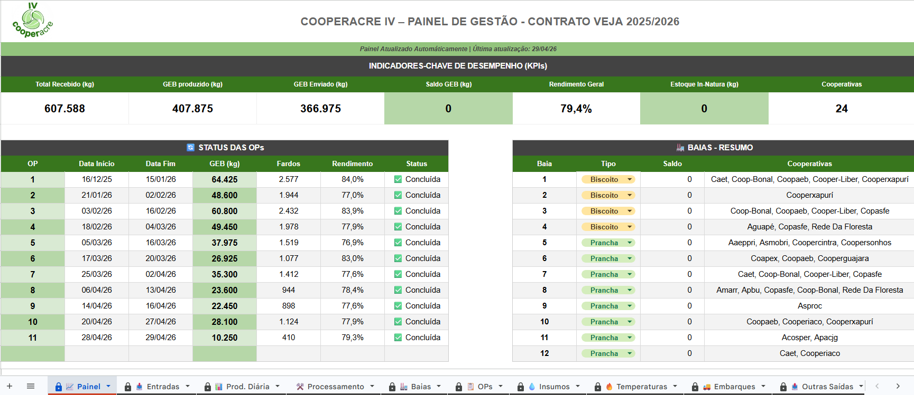

import { Badge, Card, CardGrid } from '@astrojs/starlight/components';

  <Badge text="Em uso" variant="success" size="large" />

## Em uma frase

**Centro de controle da Filial IV: registra recebimentos, produção diária, processamento, insumos, qualidade e embarques de cada safra, e alimenta os painéis online automaticamente.**

Há uma planilha por safra, como a 25/26 e a 26/27 e planilhas de apoio para tarefas específicas, descritas no [Manual Operacional](/catalogo/manual-filial-iv/).

## Antes e depois

<CardGrid>
  <Card title="Antes" icon="information">
    Cada tipo de registro da operação (entradas, produção, processamento, insumos, embarques) precisa de um lugar certo e padronizado para ser preenchido por quem está na linha.
  </Card>
  <Card title="Depois" icon="approve-check">
    Uma aba para cada registro, com campos definidos, abas automáticas de conferência (Painel e Baias) e os dados prontos para os painéis do contrato.
  </Card>
</CardGrid>

## Linha do tempo

| Quando | O que aconteceu |
|---|---|
| **safra 25/26** | Criada pelo desenvolvedor para acompanhar o contrato com a Veja |
| **safra 26/27** | Planilha da safra seguinte |
| **out/2026** | Em uso, conferido na documentação |

## Pontos fortes

<CardGrid>
  <Card title="Uma aba para cada registro" icon="document">
    Entradas, Produção diária, Processamento, Insumos, Temperaturas, Embarques e Outras saídas, cada uma com os campos de que precisa.
  </Card>
  <Card title="Conferência automática" icon="approve-check-circle">
    O Painel e as Baias se calculam sozinhos: indicadores do contrato, status das ordens de produção e saldo de cada baia.
  </Card>
  <Card title="Alimenta os painéis" icon="rocket">
    O que a equipe preenche aparece nos painéis online, sem repassar números por mensagem ou arquivo.
  </Card>
  <Card title="Planilhas de apoio" icon="setting">
    Diário GEB, Histórico Ops, Entrega de EPIs, Controle de Embalagens e outras cuidam das tarefas específicas ao redor.
  </Card>
</CardGrid>

## O que ele faz

- Registra a **entrada** de cada carregamento de borracha: data, romaneio, tipo, pesos e baia de destino
- Registra a **produção diária** de GEB por ordem de produção e o **processamento**, com as retiradas de baia
- Controla **insumos**, **temperaturas**, **embarques** e outras saídas
- Calcula sozinha o **Painel** (indicadores do contrato, status das ordens de produção) e o saldo por **Baias**
- Mantém as planilhas de apoio da filial, entre elas o [DARB](/catalogo/darb-filial-iv/) e a [Relação de Despesas](/catalogo/relacao-despesas-filial-iv/)

## Quem está por trás

<CardGrid>
  <Card title="Quem pediu" icon="pencil">
    Iniciativa do desenvolvedor.
  </Card>
  <Card title="Quem usa" icon="laptop">
    **A equipe da Filial IV**, que preenche, e a gerência, que acompanha o Painel.
  </Card>
  <Card title="Quem construiu" icon="rocket">
    **Lucas Castro**, T.I.
    Nível técnico: Fullstack Pleno
  </Card>
  <Card title="Até quando" icon="information">
    Acompanha o contrato com a Veja e a operação da filial, safra a safra. Não depende do sistema de gestão da cooperativa.
  </Card>
</CardGrid>

## Telas do sistema

Aba Painel da planilha:

*Os valores são de uma safra anterior. As cooperativas aparecem pelo nome da entidade, sem dados de pessoas.*

## Planilhas relacionadas

Alimenta o [webapp da versão Veja](/catalogo/webapp-filial-iv-veja/) e o [hub interno](/catalogo/webapp-filial-iv-interno/). O passo a passo de cada aba está no [Manual Operacional](/catalogo/manual-filial-iv/).

