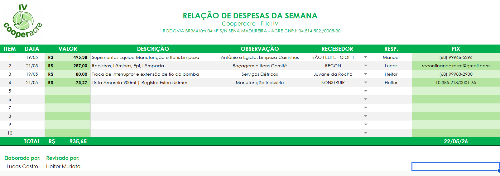

import { Badge, Card, CardGrid } from '@astrojs/starlight/components';

  <Badge text="Em uso" variant="success" size="large" />

## Em uma frase

**Planilha do fechamento semanal de despesas da filial: o fornecedor é escolhido numa lista e a chave Pix vem sozinha, e o resumo segue em PDF para o financeiro.**

## Antes e depois

<CardGrid>
  <Card title="Antes" icon="information">
    As compras da semana se acumulam em cupons e notas, que precisam virar uma relação organizada de valor, fornecedor e chave Pix.
  </Card>
  <Card title="Depois" icon="approve-check">
    Uma tabela de despesas em que o fornecedor é escolhido numa lista e a chave Pix é preenchida automaticamente, com o PDF resumo pronto para enviar com as notas escaneadas.
  </Card>
</CardGrid>

## Linha do tempo

| Quando | O que aconteceu |
|---|---|
| **out/2026** | Em uso, conferido na documentação |

## Pontos fortes

<CardGrid>
  <Card title="Fornecedor numa lista" icon="pencil">
    O campo Recebedor usa uma lista suspensa: ao escolher o fornecedor, a chave Pix é preenchida automaticamente.
  </Card>
  <Card title="Cadastro de fornecedores" icon="document">
    Uma aba própria guarda os fornecedores e as chaves. Para um fornecedor novo, basta acrescentar o nome e a chave.
  </Card>
  <Card title="Data automática" icon="setting">
    A data do fechamento é preenchida pelo nome da aba.
  </Card>
  <Card title="PDF para o financeiro" icon="approve-check-circle">
    O resumo da planilha é juntado às notas escaneadas em um único PDF, na mesma ordem da planilha.
  </Card>
</CardGrid>

## O que ele faz

- Reúne as despesas da semana: valor, descrição, observação, recebedor e chave Pix
- Soma notas do mesmo fornecedor em uma linha e ordena do maior para o menor valor
- Mantém o cadastro de fornecedores e o total do fechamento
- Gera o resumo em PDF que segue ao financeiro com os comprovantes

## Quem está por trás

<CardGrid>
  <Card title="Quem pediu" icon="pencil">
    Iniciativa do desenvolvedor.
  </Card>
  <Card title="Quem usa" icon="laptop">
    - **A equipe da Filial IV**, no fechamento semanal
    - **O financeiro**, que recebe o PDF
  </Card>
  <Card title="Quem construiu" icon="rocket">
    **Lucas Castro**, T.I.
    Nível técnico: Fullstack Pleno
  </Card>
  <Card title="Até quando" icon="information">
    Acompanha o procedimento de despesas semanais da filial. Não depende do sistema de gestão da cooperativa, mas pode ser encerrado após o go live do TOTVS, previsto para 01/01/2027.
  </Card>
</CardGrid>

## Telas do sistema

Relação de Despesas preenchida:

*Valores e fornecedores de um fechamento anterior.*

## Planilhas relacionadas

O fechamento semanal está descrito no [Manual Operacional](/catalogo/manual-filial-iv/), no procedimento de despesas, e a relação é uma das planilhas de apoio da [Planilha de Contrato](/catalogo/planilha-contrato-filial-iv/).

