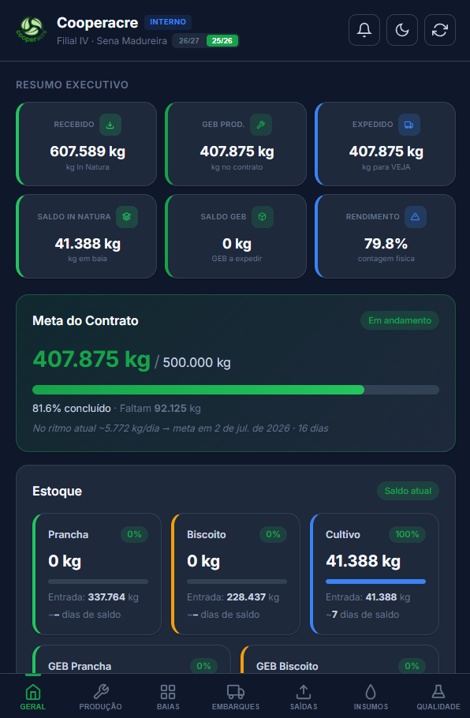

import { Badge, Card, CardGrid } from '@astrojs/starlight/components';

  <Badge text="Em uso" variant="success" size="large" />
  <Badge text="Acesso pela internet" variant="note" size="large" />

## Em uma frase

**Hub com sete abas que mostra à equipe da Filial IV a produção, o estoque por baia, a qualidade, os insumos, os embarques e as saídas da safra, lendo direto da planilha de contrato.**

## Antes e depois

<CardGrid>
  <Card title="Antes" icon="information">
    Os dados de recebimento, produção, insumos, qualidade e embarque ficam em várias abas da [Planilha de Contrato](/catalogo/planilha-contrato-filial-iv/).
  </Card>
  <Card title="Depois" icon="approve-check">
    Um painel por aba, no celular ou no computador, com alertas e comparações já calculados, que se atualiza a cada carregamento a partir da mesma planilha.
  </Card>
</CardGrid>

## Linha do tempo

| Quando | O que aconteceu |
|---|---|
| **17/03/2026** | Início do desenvolvimento, por iniciativa do desenvolvedor |
| **30/03/2026** | Hub interno, com aplicativo instalável próprio, separado da versão para a Veja |
| **mai/2026** | Alternância entre as safras 25/26 e 26/27 |
| **ago/2026** | Auditoria automática dos números contra as planilhas ao vivo |
| **out/2026** | Em uso, conferido na documentação |

## Pontos fortes

<CardGrid>
  <Card title="Sete abas, uma por assunto" icon="document">
    Geral, Produção, Qualidade, Insumos, Embarques, Baias e Saídas, para achar cada número sem abrir a planilha.
  </Card>
  <Card title="Alertas de estoque" icon="information">
    Avisa quando o estoque de uma baia ou de um tipo de borracha está baixo e mostra os dias de saldo pelo ritmo atual.
  </Card>
  <Card title="Qualidade e rendimento" icon="approve-check-circle">
    Sujidade, viscosidade e rendimento por ordem de produção, com indicação visual quando saem dos limites aceitáveis.
  </Card>
  <Card title="Insumos por tonelada" icon="setting">
    Consumo de lenha e água por tonelada, por ordem de produção, e estimativa para completar o contrato.
  </Card>
</CardGrid>

## O que ele faz

- **Geral:** resumo da safra, meta do contrato, estoque de in natura e de GEB, última entrada
- **Produção:** totais por tipo, produção mensal, dias trabalhados, médias e resumo por ordem de produção
- **Baias:** estoque por baia, mapa visual, ranking de recebimento por cooperativa e mapa das regiões de compra
- **Embarques e Saídas:** histórico por embarque, tipo de borracha, fardos, paletes e ordens de produção
- **Insumos e Qualidade:** consumo, eficiência entre ordens de produção, sujidade e viscosidade

## Quem está por trás

<CardGrid>
  <Card title="Quem pediu" icon="pencil">
    Iniciativa do desenvolvedor.
  </Card>
  <Card title="Quem usa" icon="laptop">
    **A equipe da Filial IV**, pela versão interna.
  </Card>
  <Card title="Quem construiu" icon="rocket">
    **Lucas Castro**, T.I.
    Nível técnico: Fullstack Pleno
  </Card>
  <Card title="Até quando" icon="information">
    Acompanha a operação da filial. Não depende do sistema de gestão da cooperativa, só da planilha de contrato.
  </Card>
</CardGrid>

## Telas do sistema

Aba Geral, no celular, em modo escuro:

*Os valores são de uma safra anterior e mostram o formato da tela.*

## Planilhas relacionadas

[Planilha de Contrato da Filial IV](/catalogo/planilha-contrato-filial-iv/), que alimenta o painel. A versão para o cliente está em [Webapp Filial IV: versão Veja](/catalogo/webapp-filial-iv-veja/).

