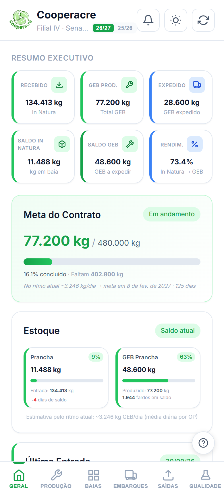

import { Badge, Card, CardGrid } from '@astrojs/starlight/components';

  <Badge text="Em uso" variant="success" size="large" />
  <Badge text="Acesso pela internet" variant="note" size="large" />

## Em uma frase

**Aplicativo instalável no celular que mostra à Veja e aos parceiros, a cada carregamento, quanto de borracha chegou, quanto de GEB foi produzido e embarcado e como está a meta do contrato.**

O **GEB** (Granulado Escuro Brasileiro) é a matéria-prima das solas dos tênis da Veja. Esta versão do painel é a que o cliente acompanha.

## Antes e depois

<CardGrid>
  <Card title="Antes" icon="information">
    Era preciso elaborar relatórios semanais com os dados segregados em várias planilhas, para informar o andamento do contrato à Veja.
  </Card>
  <Card title="Depois" icon="approve-check">
    Um dashboard em tempo real para a cliente, só com as informações escolhidas, lido direto da [Planilha de Contrato](/catalogo/planilha-contrato-filial-iv/) a cada carregamento. Disponível no celular, como aplicativo instalável, e também pelo navegador no computador.
  </Card>
</CardGrid>

## Linha do tempo

| Quando | O que aconteceu |
|---|---|
| **17/03/2026** | Início do desenvolvimento, por iniciativa do desenvolvedor |
| **mai/2026** | Alternância entre as safras 25/26 e 26/27 |
| **ago/2026** | Auditoria automática dos números contra as planilhas ao vivo |
| **out/2026** | Em uso, conferido na documentação |

## Pontos fortes

<CardGrid>
  <Card title="Instalável no celular" icon="laptop">
    É um aplicativo web: instala-se direto pelo navegador, sem loja de aplicativos, e funciona em Android e em iPhone (iOS) com o mesmo link. Também abre sem internet, mostrando a última posição carregada.
  </Card>
  <Card title="Meta do Contrato" icon="approve-check-circle">
    Mostra quanto já foi produzido, quanto falta e, pelo ritmo atual, a data prevista para chegar à meta da safra.
  </Card>
  <Card title="Só o que o cliente precisa ver" icon="pencil">
    A versão Veja oculta informações internas, como a borracha de cultivo, os insumos detalhados e a produção mensal completa.
  </Card>
  <Card title="Números conferidos" icon="setting">
    Existe uma auditoria automática que confere os cálculos contra as planilhas e garante que a versão Veja não mostra dados internos.
  </Card>
</CardGrid>

## O que ele faz

- Resumo executivo com o recebido, o GEB produzido e expedido, o saldo e o rendimento
- Meta do contrato, com percentual concluído e previsão de conclusão pelo ritmo atual
- Estoque de borracha in natura e de GEB, por tipo
- Produção, baias, embarques, saídas e qualidade, em abas
- Alternância entre as safras 25/26 e 26/27, modo claro e escuro e botão para recarregar os dados

## Quem está por trás

<CardGrid>
  <Card title="Quem pediu" icon="pencil">
    Iniciativa do desenvolvedor.
  </Card>
  <Card title="Quem usa" icon="laptop">
    **VEJA**
  </Card>
  <Card title="Quem construiu" icon="rocket">
    **Lucas Castro**, T.I.
    Nível técnico: Fullstack Pleno
  </Card>
  <Card title="Até quando" icon="information">
    Acompanha o contrato com a Veja, direto da planilha de contrato. Não depende do ERP, mas pode ser encerrado após o go live do TOTVS, previsto para 01/01/2027.
  </Card>
</CardGrid>

## Telas do sistema

Tela inicial (aba Geral), no celular:

*Os valores são do contrato em andamento e aparecem na tela conforme a planilha.*

## Planilhas relacionadas

- [Planilha de Contrato da Filial IV](/catalogo/planilha-contrato-filial-iv/), que alimenta o painel
- A versão para a equipe da filial está em [Webapp Filial IV: interno](/catalogo/webapp-filial-iv-interno/)

