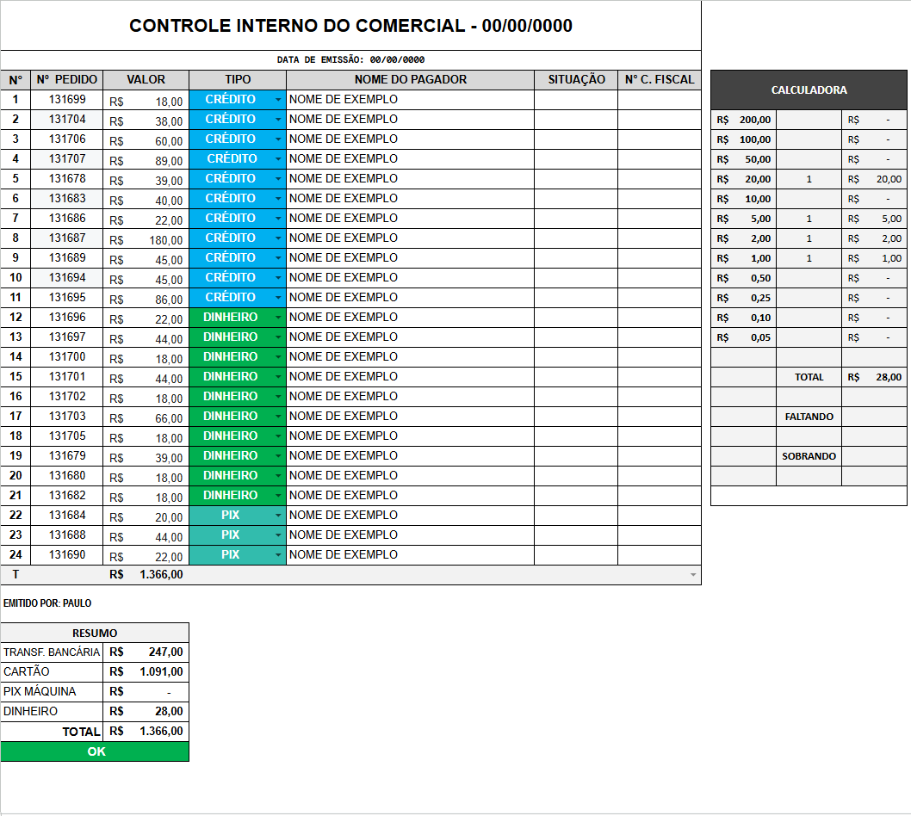

import { Badge, Card, CardGrid } from '@astrojs/starlight/components';

  <Badge text="Em uso" variant="success" size="large" />

## Em uma frase

**Registra a forma de pagamento de cada pedido, confere os totais e serve como relação para o que vai ser faturado, buscando os dados do pedido por fórmula em vez de exigir digitação de novo.**

O controle da forma de pagamento já existia antes, em Excel. O que mudou foi a migração para o Google Sheets, com dois reforços novos.

## Antes e depois

<CardGrid>
  <Card title="Antes" icon="information">
    Cada pedido é digitado de novo, à mão, em Excel, e a conferência contra o valor esperado não é automática.
  </Card>
  <Card title="Depois" icon="approve-check">
    O número do pedido puxa por fórmula os dados já registrados no Controle de Saída, com selos de forma de pagamento e fórmulas de contraprova que avisam quando algo não fecha.
  </Card>
</CardGrid>

## Pontos fortes

<CardGrid>
  <Card title="Busca pelo número do pedido" icon="approve-check-circle">
    Digita o número do pedido e o valor vem do Controle de Saída, sem digitar de novo.
  </Card>
  <Card title="Forma de pagamento com selo colorido" icon="pencil">
    Forma de pagamento (dinheiro, PIX, PIX máquina, cartão) aparece como selo colorido, fácil de reconhecer de relance.
  </Card>
  <Card title="Fórmulas de contraprova" icon="setting">
    Confere se os totais batem e avisa quando falta preencher alguma informação ou um valor está divergente, antes de aprofundar a investigação.
  </Card>
  <Card title="Calculadora de caixa" icon="rocket">
    Conta cédulas e moedas do valor mais alto ao mais baixo e mostra a diferença para o valor esperado em dinheiro, como falta ou sobra.
  </Card>
</CardGrid>

## Como funciona

**Uma aba por dia.** Cada linha é um pedido: número, valor recebido, forma de pagamento (selo colorido), nome do pagador, situação e número do cupom fiscal. O valor vem por fórmula a partir do número do pedido digitado, buscando no Controle de Saída; forma de pagamento e nome do pagador são preenchidos por quem recebeu o valor.

**Resumo por forma de pagamento.** Totaliza o dia por transferência bancária, cartão, PIX máquina e dinheiro, e compara com a soma das linhas individuais. Uma célula de conferência mostra se o total fechou, como um primeiro alerta antes de investigar linha a linha.

**Calculadora de caixa.** Uma contagem de cédulas e moedas (do valor mais alto ao mais baixo, com a quantidade de cada uma) calcula o total em espécie contado fisicamente e mostra a diferença para o valor esperado em dinheiro, como falta ou sobra.

O fluxo é: o usuário lança os pedidos do dia e a forma como cada um foi pago, a planilha confere os totais, e o resultado segue para a gerência administrativa como relação do que vai ser faturado.

## De onde vêm os dados

- Pedidos e valores: aba DADOS do [Controle de Saída](/catalogo/controle-de-saida/), que já vêm do [Meta Pipeline](/catalogo/meta-pipeline/), buscados por fórmula a partir do número do pedido digitado.
- Forma de pagamento, nome do pagador, situação e número do cupom fiscal: preenchidos manualmente por quem recebe o pagamento.
- Totais, conferência e calculadora de caixa: calculados por fórmula.

## Quem está por trás

<CardGrid>
  <Card title="Quem pediu" icon="pencil">
    **Paulo**, Comercial Polpa.
  </Card>
  <Card title="Quem usa" icon="laptop">
    **Paulo** preenche e emite.

    **Edinar**, gerente administrativa, recebe.
  </Card>
  <Card title="Quem construiu" icon="rocket">
    **Lucas Castro**, T.I.
    Nível técnico: Fullstack Pleno
  </Card>
  <Card title="Até quando" icon="information">
    Acompanha o Controle de Saída, que a alimenta, com descontinuação prevista para o go live do TOTVS, em 01/01/2027, quando substitui o Meta.
  </Card>
</CardGrid>

## Telas

Aba do dia: um pedido por linha, com valor, forma de pagamento (selo colorido) e a calculadora de caixa ao lado. Dados fictícios (a tela original tem nome real de pagador).

## Planilhas relacionadas

[Controle de Saída](/catalogo/controle-de-saida/), que a alimenta.
