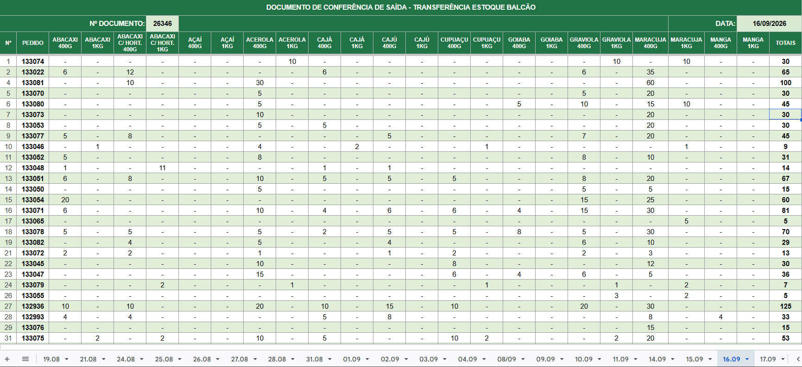
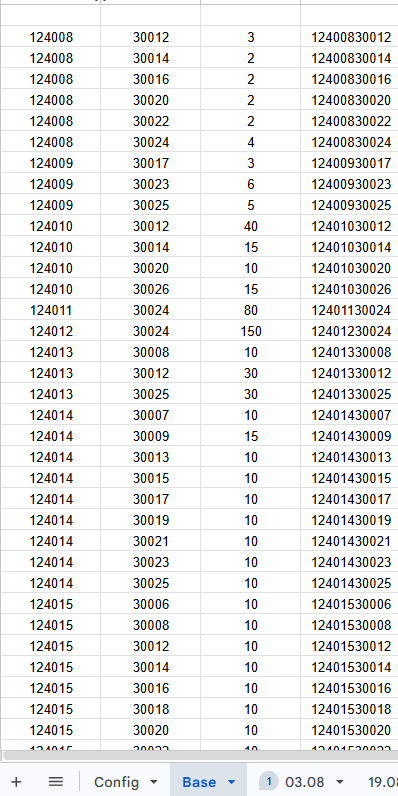
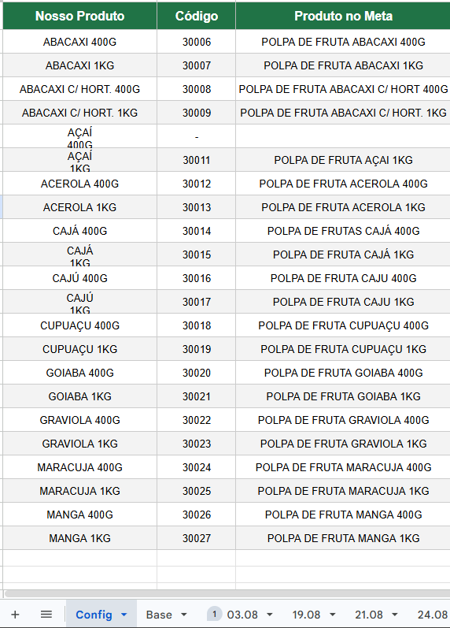

import { Badge, Card, CardGrid } from '@astrojs/starlight/components';

  <Badge text="Em uso" variant="success" size="large" />

## Em uma frase

**A partir do número de um pedido, devolve a quantidade de cada item vendido (sabor e tamanho), pronta para a nota de transferência ao estoque eletrônico da Filial 09.**

Já existia uma versão anterior desta planilha, com duas planilhas separadas (uma para 1 kg e outra para 400 g). A atual é um redesenho de layout, migrado para o Google Sheets: uma planilha só, com uma linha por pedido, e o pedido fica em vermelho quando não há polpa.

## Pontos fortes

<CardGrid>
  <Card title="Só o número do pedido" icon="approve-check-circle">
    O usuário digita só os números dos pedidos do dia; item, quantidade e nome do produto vêm todos por fórmula, sem digitar mais nada.
  </Card>
  <Card title="Grade pronta para conferência" icon="pencil">
    Uma linha por pedido, uma coluna por produto (sabor e tamanho), com o total da linha e o número do documento no topo, já em formato de comprovante.
  </Card>
  <Card title="Cópia reduzida, mais leve" icon="setting">
    Mantém só a chave de busca (pedido + produto) do Controle de Saída, em vez de ler a base inteira a cada consulta.
  </Card>
  <Card title="De-para de nomes" icon="rocket">
    Uma aba própria liga o código do produto ao nome usado aqui e ao nome como aparece no Meta Pipeline, sem depender de digitar igual em todo lugar.
  </Card>
</CardGrid>

## Como funciona

**Uma aba por dia.** O usuário digita os números dos pedidos numa coluna. A planilha localiza cada item vendido naquele pedido e monta a grade: uma linha por pedido, uma coluna por produto (sabor e tamanho), com a quantidade em cada célula e o total da linha. O topo traz o número do documento e a data, para virar o comprovante de conferência.

**BASE.** Uma cópia reduzida dos pedidos, trazida da aba DADOS do [Controle de Saída](/catalogo/controle-de-saida/). Só guarda o necessário para a busca: uma chave que combina o número do pedido com o código do produto.

**Config.** Faz duas pontes: liga o código do produto ao nome usado aqui ("Nosso Produto") e ao nome como o produto aparece no Meta Pipeline. Essa aba também define os cabeçalhos (as colunas de produto) que aparecem na aba do dia.

## De onde vêm os dados

- Pedidos faturados: aba DADOS do [Controle de Saída](/catalogo/controle-de-saida/), que já vêm do [Meta Pipeline](/catalogo/meta-pipeline/).
- Números de pedido: digitados pelo usuário.
- Tudo o mais (item, quantidade, nome do produto) é calculado por fórmula, sem digitação.

## Quem está por trás

<CardGrid>
  <Card title="Quem pediu" icon="pencil">
    **Paulo**, Comercial Polpa.
  </Card>
  <Card title="Quem usa" icon="laptop">
    **Paulo** preenche.

    **Maxsuel** recebe o resultado e emite a nota de transferência.
  </Card>
  <Card title="Quem construiu" icon="rocket">
    **Lucas Castro**, T.I.
    Nível técnico: Fullstack Pleno
  </Card>
  <Card title="Até quando" icon="information">
    Acompanha o Controle de Saída, que a alimenta, com descontinuação prevista para o go live do TOTVS, em 01/01/2027, quando substitui o Meta.
  </Card>
</CardGrid>

## Telas

Documento de conferência de um dia, com um pedido por linha e a quantidade de cada item:

Aba BASE: a chave de busca (pedido + produto) trazida do Controle de Saída:

Aba Config: de-para entre o produto usado aqui e o nome no Meta Pipeline:

*Os números de pedido e as quantidades são reais; não há nome de cliente, CNPJ nem valor em R$ nestas telas.*

## Planilhas relacionadas

[Controle de Saída](/catalogo/controle-de-saida/), que a alimenta.
